# 简介

## 目录结构

当前`linx_apd`代码目录结构如下：

```bash
.
├── cmake						/* 后续cmake文件目录 */
├── json_config					/* 存放ebpf插桩函数配置 */
├── kernel						/* 内核采集代码ebpf、kmod */
│   ├── ebpf
│   └── kmod
├── local_depends				/* linx_apd实现过程中使用到的第三方库 */
│   ├── cJSON
│   ├── libyaml
│   ├── pcre2
│   └── uthash
├── scripts						/* 一系列脚本 */
├── test						/* 测试代码 */
├── userspace
│   ├── linx_alert				/* 发送警告日志和阻断进程 */
│   │   ├── executor
│   │   ├── file
│   │   ├── http
│   │   ├── stdout
│   │   └── syslog
│   ├── linx_apd				/* linx_apd入口函数 */
│   ├── linx_arg_parser			/* 命令行参数解析 */
│   ├── linx_config				/* 全局配置，计划将 linx_apd.yaml 所有配置解析为一个全局结构体 */
│   ├── linx_engine				/* 管理ebpf、kmod以及插件的初始化、采集、销毁等 */
│   │   ├── ebpf
│   │   ├── kmod
│   │   └── plugin
│   ├── linx_event_processor	/* 多线程事件处理，未实现 */
│   ├── linx_event_queue		/* 多线程事件处理队列，未实现 */
│   ├── linx_event_rich			/* 事件丰富 */
│   ├── linx_hash_map			/* hash表，绑定键值对，可在O(1)的时间复杂度下进行查找 */
│   ├── linx_log				/* 日志接口，输出程序运行过程中的相关日志 */
│   ├── linx_process_cache		/* 进程缓存，用于提供proc字段 */
│   ├── linx_regex				/* 正则匹配，用于解析规则的条件字段 */
│   ├── linx_rule_engine		/* 规则引擎 */
│   │   ├── rule_engine_ast		/* 抽象语法树 */
│   │   ├── rule_engine_check	/* 语法检查，未实现 */
│   │   ├── rule_engine_lexer	/* 词法分析 */
│   │   ├── rule_engine_load	/* 规则加载 */
│   │   ├── rule_engine_match	/* 规则匹配 */
│   │   └── rule_engine_set		/* 规则集合 */
│   ├── linx_syscall_table		/* 系统调用表，包含所有系统调用的信息 */
│   ├── linx_thread				/* 线程池实现 */
│   └── linx_yaml				/* yaml解析 */
└── yaml_config					/* yaml配置文件 */
    ├── linx_apd_config			/* yaml配置 */
    └── linx_apd_rules			/* yaml规则 */
```

`linx_apd`采用`层级`->`主模块`->`子模块`的三级目录结构来划分，计划各个层级，各个主模块以及子模块划分如下：

| 层级      | 主模块               | 子模块   | 功能简介                                                     |
| --------- | -------------------- | -------- | ------------------------------------------------------------ |
| kernle    |                      |          |                                                              |
|           | ebpf                 |          | 内核采集系统调用、网络等信息                                 |
|           | kmod                 |          | 内核采集系统调用、网络等信息                                 |
| userspace |                      |          |                                                              |
|           | linx_alert           |          | 该模块用于发送警告日志和行为阻断                             |
|           |                      | executor | 行为阻断                                                     |
|           |                      | file     | 警告发送到文件                                               |
|           |                      | http     | 警告发送到http                                               |
|           |                      | stdout   | 警告发送到控制台                                             |
|           |                      | syslog   | 警告发送到syslog                                             |
|           | linx_apd             |          | 该模块是整个程序的入口，完成各模块的初始化<br />接收信号，进行资源清理 |
|           | linx_arg_parser      |          | 该模块用于解析命令行参数                                     |
|           | linx_config          |          | 该模块用于解析linx_apd.yaml的总体配置并且支持热更新          |
|           | linx_engine          |          | 该模块主要用于管理所有事件源的加载/卸载，以及从事件源读取消息 |
|           |                      | ebpf     | 动态加载ebpf                                                 |
|           |                      | kmod     | 动态加载内核模块                                             |
|           |                      | plugin   | 插件管理框架                                                 |
|           | linx_event_processor |          | 该模块使用多线程处理事件的获取以及匹配                       |
|           | linx_event_queue     |          | 该模块用于管理事件源上传来的消息                             |
|           | linx_event_rich      |          | 该模块主要用于丰富事件上下文                                 |
|           | linx_hash_map        |          | 该模块可创建hash表，绑定键值对，使其可以高效的查找           |
|           | linx_log             |          | 该模块管理所有模块的日志输出                                 |
|           | linx_process_cache   |          | 该模块用于读取/proc缓存进程相关信息                          |
|           | linx_regex           |          | 该模块用于正则匹配                                           |
|           | linx_rule_engine     |          | 该模块负责规则解析（YAML->内部结构）                         |
|           |                      | ast      | 抽象语法树                                                   |
|           |                      | check    | 语法检查                                                     |
|           |                      | lexer    | 词法分析                                                     |
|           |                      | load     | 规则加载                                                     |
|           |                      | match    | 规则匹配                                                     |
|           |                      | set      | 规则集合                                                     |
|           | linx_thread          |          | 该模块提供线程池服务                                         |
|           | linx_yaml            |          | 该模块用于解析YAML文件                                       |

整体关系如下所示：

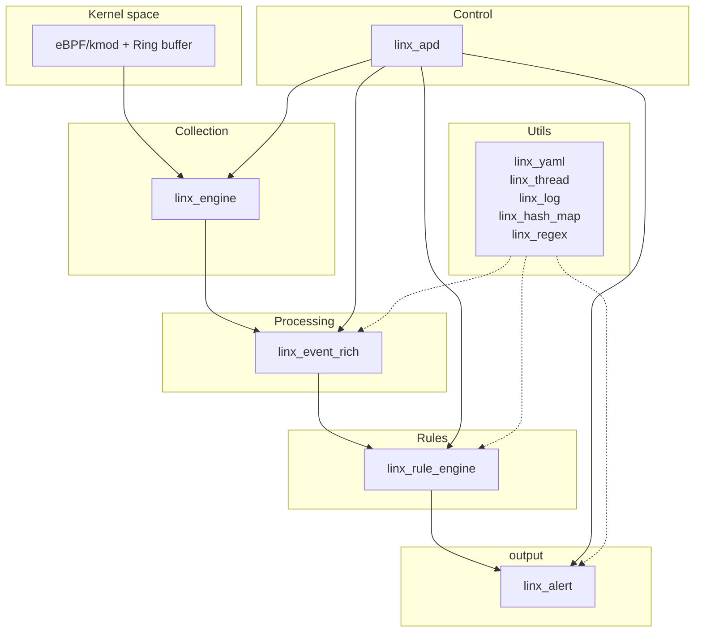

各个模块依赖如下所示：

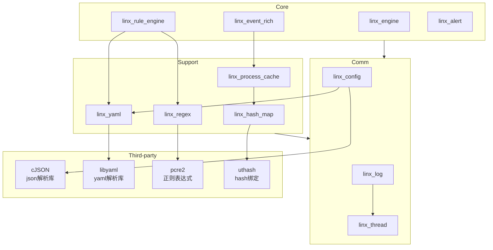


# 模块详解

## linx_apd

### 简介

该模块是整个系统的主程序模块，负责统筹协调所有子模块的初始化、配置加载、事件循环和资源清理，核心功能：

- 启动流程管理：按照依赖关系顺序初始化各个模块
- 配置协调：集成参数解析和配置加载
- 事件循环：实现主要的事件处理循环
- 信号处理：处理系统信号和资源清理

代码结构如下：

```tex
.
├── include
│   ├── linx_resource_cleanup.h			# 资源清理
│   └── linx_signal.h					# 信号处理
├── linx_apd.c							# 主程序入口
├── linx_resource_cleanup.c				# 资源清理实现
└── linx_signal.c						# 信号处理实现
```

主要工作流程如下：

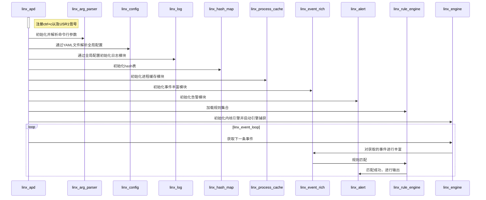

### 依赖

依赖所有模块

### 核心接口

```c
int main(int argc, char *argv[]);	// 入口函数
static int linx_event_loop(void);	// 事件循环
```

### 信号处理

当前支持的信号：

- SIGINT：中断信号，触发资源清理并退出
- SIGUSR1：用户信号，触发资源清理并退出

信号处理函数：

```c
void linx_setup_signal(int signum);				// 信号注册函数
static void linx_signal_handler(int signum);	// 信号处理函数
```

### 资源回收

资源回收是按照初始化的逆序进程资源清理的，并且通过信号触发。

资源回收类型：

```c
typedef enum {
    LINX_RESOURCE_CLEANUP_ERROR,
    LINX_RESOURCE_CLEANUP_ARGS,				// 参数解析
    LINX_RESOURCE_CLEANUP_CONFIG,			// 配置
    LINX_RESOURCE_CLEANUP_LOG,				// 日志
    LINX_RESOURCE_CLEANUP_HASH_MAP,			// hash表
    LINX_RESOURCE_CLEANUP_PROCESS_CACHE,	// 进程缓存
    LINX_RESOURCE_CLEANUP_EVENT_QUEUE,		// 事件队列
    LINX_RESOURCE_CLEANUP_EVENT_RICH,		// 事件丰富
    LINX_RESOURCE_CLEANUP_ALERT,			// 告警模块
    LINX_RESOURCE_CLEANUP_RULE_ENGINE,		// 规则引擎
    LINX_RESOURCE_CLEANUP_ENGINE,			// 数据引擎
    LINX_RESOURCE_CLEANUP_MAX
} linx_resource_cleanup_type_t;
```

清理函数：

```c
void linx_resource_cleanup(void);
```

## linx_arg_parser

### 简介

该模块是系统的命令行参数解析模块，负责解析和验证用户提供的命令行参数，为主程序提供配置文件路径等关键参数。

代码结构如下：

```bash
.
├── include
│   └── linx_arg_parser.h
├── linx_arg_parser.c
├── Makefile
└── README.md
```

### 核心接口

```c
// 参数解析初始化
int linx_arg_init(void);

// 获取 argp 结构
const struct argp *linx_argp_get_argp(void);

// 实际参数解析
static error_t linx_arg_parse(int key, char *arg, struct argp_state *state);

// 获取解析后的配置
linx_arg_config_t *linx_arg_get_config(void);
```

解析完毕后导出一个全局变量`linx_arg_config`，该变量定义如下：

```c
typedef struct linx_arg_config {
    char *linx_apd_config;
    char *linx_apd_rules;
} linx_arg_config_t;
```

这两个成员主要在后面的`linx_config`和`linx_rule_engine`中作为输入参数使用。

### 支持的参数

```bash
Usage: linx_apd [OPTION...]

	-c, --config=<file_name>		指定配置文件路径
	-r, --rules=<file_name|path>	指定规则文件路径或目录
	-?, --help						Give this help list
		--usage						Give this usage message
	-V, --version					Print program version
```

### 功能扩展

若要新增参数则需要三个步骤

1. 定义参数信息

   参数信息定义于`userspace/linx_arg_parser/linx_arg_parser.c`文件中，格式如下：

   ```c
   static const struct argp_option linx_arg_options[] = {
       /* 长选项名，短选项名，参数名，             选项标志，帮助文档描述，                    选项分组 */
       {"config",      'c',    "<file_name>",          0,          "指定配置文件路径",         0},
       {"rules",       'r',    "<file_name|path>",     0,          "指定规则文件路径或目录",   0},
       {}
   };
   ```

   若需要新增参数，则在`{}`前添加即可。

2. 结构体内定义对应成员

   存储命令行解析出来的参数位于`userspace/linx_arg_parser/include/linx_arg_parser.h`文件中，格式如下：

   ```c
   typedef struct linx_arg_config {
       char *linx_apd_config;
       char *linx_apd_rules;
   } linx_arg_config_t;
   ```

   按需增加成员即可。

3. 在linx_arg_parse函数进行解析

   实际的参数解析位于`userspace/linx_arg_parser/linx_arg_parser.c`文件的`linx_arg_parse`函数，通过判断参数信息中的短参即可进行实际的解析，例如：

   ```c
   static error_t linx_arg_parse(int key, char *arg, struct argp_state *state)
   {
       (void)state;
       // struct arguments *arguments = state->input;
   
       switch (key) {
       case 'c':
           linx_arg_config->linx_apd_config = strdup(arg);
           break;
       case 'r':
           linx_arg_config->linx_apd_rules = strdup(arg);
           break;
       default:
           return ARGP_ERR_UNKNOWN;
           break;
       }
   
       return 0;
   }
   ```

## linx_config

### 简介

该模块是系统的配置管理模块，负责解析和管理`linx_apd.yaml`配置文件，提供全局配置访问接口，并支持热更新功能（未实现）。核心功能如下：

- 配置解析：解析YAML格式的主配置文件
- 全局配置：提供系统级别的配置参数管理
- 热更新：支持配置文件的动态重载
- 配置验证：配置参数的有效性验证

代码结构如下：

```bash
.
├── include
│   └── linx_config.h
├── linx_config.c
├── Makefile
└── README.md
```

### 依赖

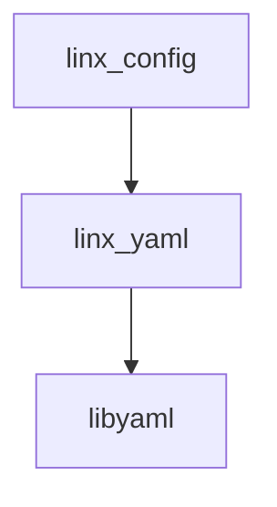


### 核心接口

```c
// 配置模块生命周期管理
int linx_config_init(void);
void linx_config_deinit(void);

// 配置加载和重载
int linx_config_load(const char *config_file);
int linx_config_reload(void);

// 配置访问
linx_global_config_t *linx_config_get(void);
```

### 全局配置结构

```c
typedef struct {
    struct {
        char *output;			// 日志输出路径
        char *log_level;		// 日志等级
    } log_config;

    struct {
        char *kind;				// 数据引擎类型（ebpf/kmod）

        union {
            struct {
                char *path;		// 未实现
            } kmod;

            struct {
                bool drop_mode;		// 丢弃模式
                bool drop_failed;	// 丢弃失败事件
                uint32_t filter_pids[LINX_BPF_FILTER_PID_MAX_SIZE];		// 过滤的pid
                uint8_t filter_comms[LINX_BPF_FILTER_COMM_MAX_SIZE][LINX_COMM_MAX_SIZE]; // 过滤的命令
                uint8_t interest_syscall_table[LINX_SYSCALL_ID_MAX];	// 需要采集的系统调用
            } ebpf;
        } data;
    } engine;
} linx_global_config_t;
```

目前实际只解析并使用了`linx_log`日志模块的配置、以及`ebpf`的配置。

### 配置文件结构

只罗列当前配置文件所解析了的内容：

```yaml
# 日志配置
# 输出文件路径，可选配置为 stderr 和 文件路径，默认为 stderr
# level: 日志级别，可选值：DEBUG, INFO, WARNING, ERROR, FATAL, 默认为ERROR
log:
  output: stderr
  level: ERROR

engine:
  kind: ebpf
  kmod:
    log_path: /tmp/ebpf.log
  ebpf:
    drop_mode: false
    drop_failed: true
    filter_pids: []
    filter_comms: []
    interest_syscall_file: /root/project/linx_apd/json_config/interesting_syscalls.json
```

### 功能扩展

若需要新增配置则需要以下步骤：

1. 定义结构体成员

   结构体位于`userspace/linx_config/include/linx_config.h`中，按需新增成员即可

2. 解析配置

   解析配置逻辑位于`userspace/linx_config/linx_config.c`文件的`linx_config_load`函数，在解析过程中使用到了`linx_yaml`模块，通过其导出的函数可获取`yaml`文件配置的相关信息

## linx_log

### 简介

该模块是系统的统一日志管理模块，提供多级别、多输出的日志记录功能，支持结构化日志功能。核心功能：

- 多级别日志：DEBUG、INFO、WARNING、ERROR、FATAL

- 多输出方式：支持文件、stderr等输出方式

- 结构化日志：以固定格式输出

  ```
  year-month-day hours:min:sec.msec [log_level] [file_name:line] log_message
  ```

- 性能优化：通过线程异步写入日志

代码结构如下：

```bash
.
├── include
│   ├── linx_log.h			# 日志接口
│   ├── linx_log_level.h	# 日志等级
│   └── linx_log_message.h	# 日志消息结构体
├── linx_log.c
├── Makefile
└── README.md
```

大致执行流程如下：

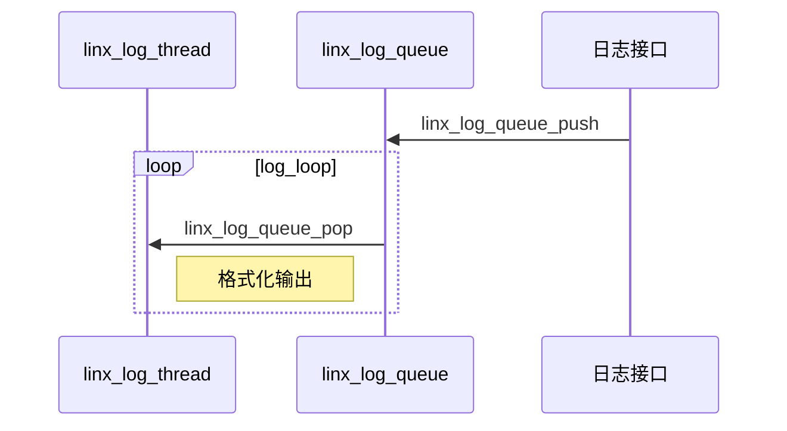

### 依赖

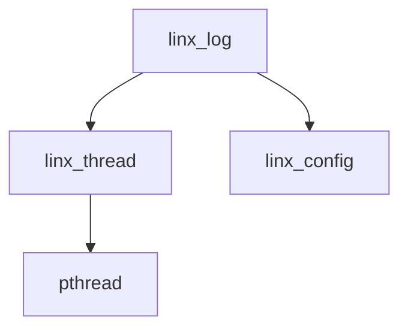


### 核心接口

```c
// 日志系统初始化
int linx_log_init(const char *log_file, const char *log_level);
void linx_log_deinit(void);

// 基本日志宏
#define LINX_LOG_DEBUG(...)
#define LINX_LOG_INFO(...)
#define LINX_LOG_WARNING(...)
#define LINX_LOG_ERROR(...)
#define LINX_LOG_FATAL(...)

// 日志处理线程
static void *linx_log_thread(void *arg, int *should_stop)
```

### 功能扩展

当前日志模块只支持配置日志等级以及输出文件路径，默认是`stderr`，若后续需要扩展，则修改`userspace/linx_log`下文件即可。

## linx_hash_map

### 简介

该模块是系统的哈希表工具模块，提供高效的键值对存储和查询功能，主要用于字段绑定和快速数据查找。核心功能：

- 字段映射：实现规则字段到结构体偏移的快速绑定
- 类型管理：支持多种数据类型的存储和转换
- 高效查询：提供O(1)时间复杂度的数据查询

代码结构如下：

```bash
.
├── include
│   ├── field_info.h		# 字段信息
│   ├── field_table.h		# 表信息
│   ├── field_type.h		# 字段类型
│   └── linx_hash_map.h		# 哈希表定义
├── linx_hash_map.c			# 哈希表实现
└── Makefile
```

### 依赖

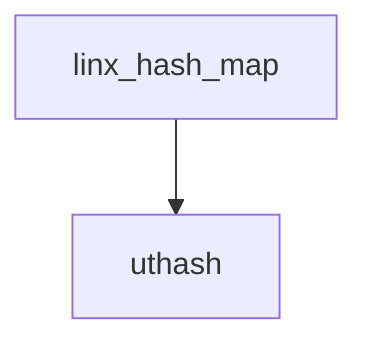


### 核心接口

```c
// 哈希表初始化
int linx_hash_map_init(void);
void linx_hash_map_deinit(void);

// 创建表
int linx_hash_map_create_table(const char *table_name, void *base_addr);
int linx_hash_map_remove_table(const char *table_name);

// 绑定字段
int linx_hash_map_add_field(const char *table_name, const char *field_name, size_t offset, size_t size, field_type_t type);

// 批量绑定字段
int linx_hash_map_add_field_batch(const char *table_name, const field_mapping_t *mappings, size_t count);

// 通过表名和字段名查找
field_result_t linx_hash_map_get_field(const char *table_name, const char *field_name);

// 通过表名.字段名查找
field_result_t linx_hash_map_get_field_by_path(char *path);

// 获取字段对应的成员地址
void *linx_hash_map_get_value_ptr(const field_result_t *field);

// 更新表的基地址
int linx_hash_map_update_table_base(const char *table_name, void *base_addr);
int linx_hash_map_update_tables_base(field_update_table_t *tables, size_t num_tables);
```

其关键结构体`linx_hash_map_t`定义如下：

```c
typedef struct {
    char *key;              /* 字段名 */
    size_t offset;          /* 在结构体内的偏移 */
    size_t size;            /* 该字段的大小 */
    field_type_t type;
    UT_hash_handle hh;
} field_info_t;

typedef struct {
    char *table_name;
    field_info_t *fields;
    void *base_addr;        /* 结构体的基地址 */
    UT_hash_handle hh;
} field_table_t;

typedef struct {
    field_table_t *tables;
    size_t size;
    size_t capacity;
} linx_hash_map_t;
```

### 功能扩展

修改`userspace/linx_hash_map`下文件即可

## linx_process_cache

### 简介

该模块是系统的进程缓存模块，负责缓存进程相关信息以提高查询效率。它通过实时扫描`/proc`文件系统，建立进程信息的缓存，为事件丰富模块提供快速的进程信息查询服务。核心功能：

- 实时进程扫描：定期扫描`/proc`目录获取进程信息
- 快速查询接口：提供O(1)时间复杂度的进程信息查询
- 内存优化：自动删除过期缓存
- 提供字段：通过`linx_hash_map`绑定结构体偏移，提供`proc.xxx`规则字段

代码结构如下：

```bash
.
├── include
│   ├── linx_process_cache_define.h		# 缓存信息共用宏定义
│   ├── linx_process_cache.h			# 缓存接口
│   ├── linx_process_cache_info.h		# 缓存结构体
│   └── linx_process_state.h			# 进程状态
├── linx_process_cache.c				# 缓存接口实现
├── Makefile
└── README.md
```

### 依赖

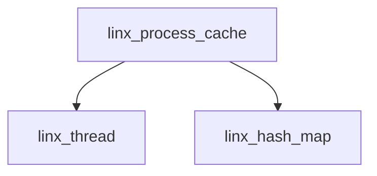


### 核心接口

```c
// 进程缓存初始化
int linx_process_cache_init(void);
void linx_process_cache_deinit(void);

// 进程信息查询
linx_process_info_t *linx_process_cache_get(pid_t pid);
int linx_process_cache_get_all(linx_process_info_t **list, int *count);

// 进程缓存更新
int linx_process_cache_update_async(pid_t pid);
int linx_process_cache_update_sync(pid_t pid);

// 进程缓存删除
int linx_process_cache_delete(pid_t pid);
int linx_process_cache_cleanup(void);

// 统计接口
void linx_process_cache_stats(int *total, int *alive, int *expired);
```

进程信息结构体：

```c
typedef struct {
    pid_t pid;
    pid_t ppid;
    pid_t pgid;
    pid_t sid;
    pid_t uid;
    pid_t gid;

    char name[PROC_COMM_MAX_LEN];
    char comm[PROC_COMM_MAX_LEN];
    char cmdline[PROC_CMDLINE_LEN];
    char exe[PROC_PATH_MAX_LEN];
    char cwd[PROC_PATH_MAX_LEN];

    linx_process_state_t state;
    int nice;
    int priority;
    unsigned long vsize;
    unsigned long rss;
    unsigned long shared;

    unsigned long utime;
    unsigned long stime;
    unsigned long start_time;

    time_t create_time;
    time_t update_time;
    time_t exit_time;
    int is_alive;

    UT_hash_handle hh;
} linx_process_info_t;
```

### 功能扩展

更新字段绑定信息：修改`linx_process_cache_bind_field`函数

更新需要缓存的信息：修改`linx_process_info_t`结构体，修改`create_process_info`函数

## linx_event_rich

### 简介

该模块是系统的事件上下文丰富模块，负责从内核采集的原始事件添加丰富的上下文信息。它通过进程树构建、文件信息获取、网络连接解析等方式，将简单的系统调用事件转换为包含完整上下文的安全事件。核心功能：

- 进程上下文丰富：获取进程的详细信息和进程树关系
- 文件信息增强：添加文件权限、所有者等信息（未实现）
- 用户信息获取：用户名、组信息、权限等（未实现）
- 提供字段：通过`linx_hash_map`绑定结构体偏移，提供`evt.xxx`规则字段

代码结构如下：

```bash
.
├── include
│   ├── event.h				# evt 字段结构体
│   └── linx_event_rich.h
├── linx_event_rich.c
├── Makefile
└── README.md
```

### 依赖

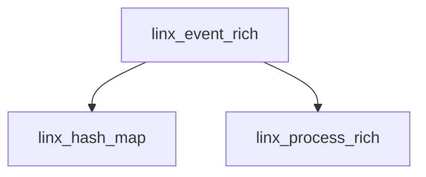


### 核心接口

```c
# 模块初始化
int linx_event_rich_init(void);
int linx_event_rich_deinit(void);

# 事件丰富处理
int linx_event_rich(linx_event_t *event);
```

`evt`结构体结构：

```c
typedef struct {
    uint64_t num;   /* 事件编号 */
    char time[64];  /* 时间戳字符串，包含纳秒（查看falco还有不是纳秒的情况，后续考虑用enum实现？） */
    char *type;     /* 对应的系统调用名，这里用指针是因为在linx_syscall_table中定义好了字符串，不用再拷贝一份 */
    char args;      /* 所有事件参数聚合为一个字符串，不知道用指针还是数组 */
    char res[16];   /* 成功是SUCCESS，失败是错误码字符串 */
    int64_t rawres; /* 返回值的具体数值 */
    bool failed;    /* 返回失败的事件，该值为true */
    char dir[1];    /* > 表示进入事件，< 表示退出事件 */
} event_t;
```

### 功能扩展

后续需要更新结构体内的相关内容

## linx_alert

### 简介

该模块是系统的告警输出模块，负责将规则匹配成功后，将结果格式化并输出到不同目标渠道。核心功能：

- 多渠道输出：支持file、http、stdout、syslog多种输出方式，目前代码只支持stdout
- 异步处理：创建四个线程异步告警处理机制
- 格式化输出：将规则字段转换为实际消息进行输出
- 配置管理：配置各个输出渠道的参数

代码目录如下：

```bash
.
├── executor					# 行为阻断
├── file
│   └── linx_alert_file.c		# 输出到文件
├── http
│   └── linx_alert_http.c		# 输出到 http
├── include
│   └── linx_alert.h
├── linx_alert.c
├── Makefile
├── README.md
├── stdout
│   └── linx_alert_stdout.c		# 输出到 stdout
└── syslog
    └── linx_alert_syslog.c		# 输出到 syslog
```

### 依赖

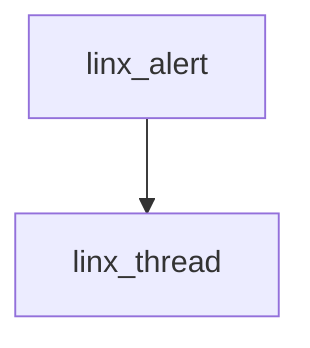

### 核心接口

```c
/* 初始化和清理函数 */
int linx_alert_init(int thread_pool_size);
void linx_alert_deinit(void);

/* 配置管理函数 */
int linx_alert_set_config_enable(linx_alert_type_t type, bool enable);
int linx_alert_update_config(linx_alert_config_t config);

/* 核心输出函数 */
int linx_alert_send_async(linx_output_match_t *output, const char *rule_name, int priority);
int linx_alert_send_sync(linx_output_match_t *output, const char *rule_name, int priority);

/* 格式化和发送函数 */
int linx_alert_format_and_send(linx_output_match_t *output, const char *rule_name, int priority);

/* 统计信息函数 */
void linx_alert_get_stats(long *total_send, long *total_fail);

/* 输出后端函数 */
int linx_alert_output_stdout(linx_alert_message_t *message, linx_alert_config_t *config);
int linx_alert_output_file(linx_alert_message_t *message, linx_alert_config_t *config);
int linx_alert_output_http(linx_alert_message_t *message, linx_alert_config_t *config);
int linx_alert_output_syslog(linx_alert_message_t *message, linx_alert_config_t *config);

/* 辅助函数 */
linx_alert_message_t *linx_alert_message_create(const char *message, const char *rule_name, int priority);
void linx_alert_message_destroy(linx_alert_message_t *message);
```

### 功能扩展

需要更新输出到不同目标的代码。

## linx_rule_engine

### 简介

该模块是系统的核心规则引擎，负责将YAML格式的规则文件转换为可执行的检测逻辑。核心功能：

- 规则解析：将YAML规则文件解析为内部数据结构
- AST构建：构建抽象语法树用于条件表达式
- AST编译：将AST编译为高效的执行函数流
- 事件匹配：高性能的事件规则匹配
- 输出格式化：灵活的输出模板和格式化

代码结构如下：

```bash
.
├── include
├── Makefile
├── README.md
├── rule_engine_ast
│   ├── ast_node.c						# AST节点操作实现
│   ├── include
│   │   ├── ast_node.h					# AST节点结构体定义
│   │   ├── ast_node_type.h				# AST节点类型
│   │   ├── linx_rule_engine_ast.h		# AST接口
│   │   └── operation_type.h			# 操作类型
│   ├── linx_rule_engine_ast.c			# AST接口实现
│   └── operation_type_string.c			# 操作类型对应的字符串
├── rule_engine_check
├── rule_engine_lexer
│   ├── include
│   │   └── linx_rule_engine_lexer.h	# 词法分析接口
│   └── lexer.c							# 词法分析接口实现
├── rule_engine_load
│   ├── include
│   │   └── linx_rule_engine_load.h		# 规则加载接口
│   └── linx_rule_engine_load.c			# 规则加载接口实现
├── rule_engine_match
│   ├── include
│   │   ├── linx_rule_engine_match.h	# 规则匹配接口
│   │   ├── output_match_func.h			# 输出匹配函数
│   │   ├── output_match_struct.h		# 输出匹配结构体
│   │   ├── rule_match_context.h		# 规则匹配上下文结构体
│   │   ├── rule_match_func.h			# 规则匹配函数
│   │   └── rule_match_struct.h			# 规则匹配结构体
│   ├── linx_rule_engine_match.c		# 规则匹配接口实现
│   ├── output_match_func.c				# 输出匹配函数实现
│   └── rule_match_func.c				# 规则匹配函数实现
└── rule_engine_set
    ├── include
    │   └── linx_rule_engine_set.h		# 规则集合接口
    └── linx_rule_engine_set.c			# 规则集合接口实现
```

### 依赖

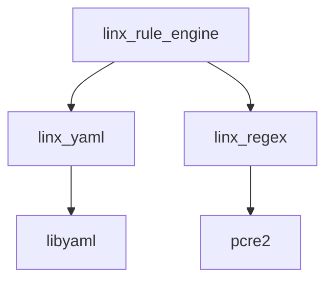

### 核心接口

```c
// 规则加载
int linx_rule_engine_load(const char *rules_file_path);

// 创建AST节点
ast_node_t *ast_node_create(ast_node_type_t type);

// 编译AST
int linx_compile_ast(ast_node_t *ast, linx_rule_match_t **match);

// 规则匹配
bool linx_rule_engine_match(linx_rule_match_t *match);

// 编译输出
int linx_output_match_compile(linx_output_match_t **match, char *format);

// 输出格式化
int linx_output_match_format(linx_output_match_t *match, char *buffer, size_t buffer_size);

// 规则集初始化
int linx_rule_set_init(void);
void linx_rule_set_deinit(void);

// 添加规则集
int linx_rule_set_add(linx_rule_t *rule, linx_rule_match_t *match, linx_output_match_t *output);

// 规则集匹配
bool linx_rule_set_match_rule(void);
```


## linx_engine

### 简介

该模块是系统的数据采集引擎，提供抽象的数据源接口，支持多种驱动（eBPF、kmod、plugin等）。它负责管理所有事件源的加载/卸载，以及从不同事件源读取消息，为上层提供统一的事件获取接口。核心功能：

- 多驱动支持：支持多种数据源
- 统一接口：为不同数据源提供统一的操作接口
- 动态加载：支持运行时动态加载和卸载数据源
- 事件获取：提供高效的事件获取机制
- 配置驱动：基于配置文件选择和配置数据源

代码结构如下：

```bash
.
├── ebpf
│   ├── include
│   │   ├── linx_ebpf_api.h
│   │   ├── linx_ebpf_common.h
│   │   └── linx_engine_ebpf.h
│   ├── linx_ebpf_load.c
│   ├── linx_ebpf_maps.c
│   ├── linx_ebpf_ringbuf.c
│   └── linx_engine_ebpf.c
├── include
│   ├── linx_engine.h			# 主要接口定义
│   └── linx_engine_vtable.h	# 统一接口定义
├── kmod
│   └── include
├── linx_engine.c
├── Makefile
├── plugin
│   └── include
└── README.md
```

### 核心接口

```c
// 数据引擎初始化与关闭
int linx_engine_init(linx_global_config_t *config);
int linx_engine_close(void);

// 获取下一条事件
int linx_engine_next(linx_event_t **event);

// 数据引擎采集启停
int linx_engine_start(void);
int linx_engine_stop(void);
```

### 功能扩展

更新其他事件源的实现

## linx_regex

### 简介

该模块是系统的正则表达式处理模块，为规则引擎提供正则表达式匹配功能。

代码结构如下：

```
.
├── include
│   └── linx_regex.h
├── linx_regex.c
└── Makefile
```

### 核心接口

```c
// 执行正则匹配
int linx_regex_match(const char *regex, const char *str, char **match);
```

## linx_thread

### 简介

该模块是系统的线程管理模块，为其他模块提供线程池服务。核心功能：

- 线程池管理：创建和管理工作线程池
- 任务调度：高效的任务分发和执行
- 优雅关闭：支持线程池的优雅关闭和资源清理

代码结构如下：

```bash
.
├── include
│   ├── linx_thread_info.h
│   ├── linx_thread_pool.h
│   └── linx_thread_state.h
├── linx_thread_pool.c
├── Makefile
└── README.md
```

其大致工作原理如下：

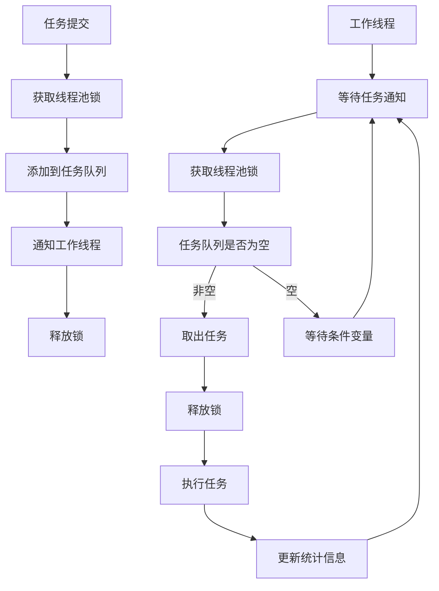


### 核心接口

```c
// 线程池创建与销毁
linx_thread_pool_t *linx_thread_pool_create(int num_threads);
int linx_thread_pool_destroy(linx_thread_pool_t *pool, int graceful);

// 添加任务
int linx_thread_pool_add_task(linx_thread_pool_t *pool, void *(*func)(void *, int *), void *arg);

// 暂停线程
int linx_thread_pool_pause_thread(linx_thread_pool_t *pool, int thread_index);

// 重启线程
int linx_thread_pool_resume_thread(linx_thread_pool_t *pool, int thread_index);

// 终止线程
int linx_thread_pool_terminate_thread(linx_thread_pool_t *pool, int thread_index);

// 获取线程状态
linx_thread_state_t linx_thread_pool_get_thread_state(linx_thread_pool_t *pool, int thread_index);
```

### 各模块线程

当前使用了线程池进行异步操作的模块有`linx_log`、`linx_process_cache`、`linx_alert`。

#### linx_log

默认创建1个线程数的线程池，添加一个`linx_log_thread`死循环任务，该任务重复在日志队列中读取日志信息，若存在，则按照配置输出，若不存在则调用`sched_yield`让出`CPU`执行其他线程。

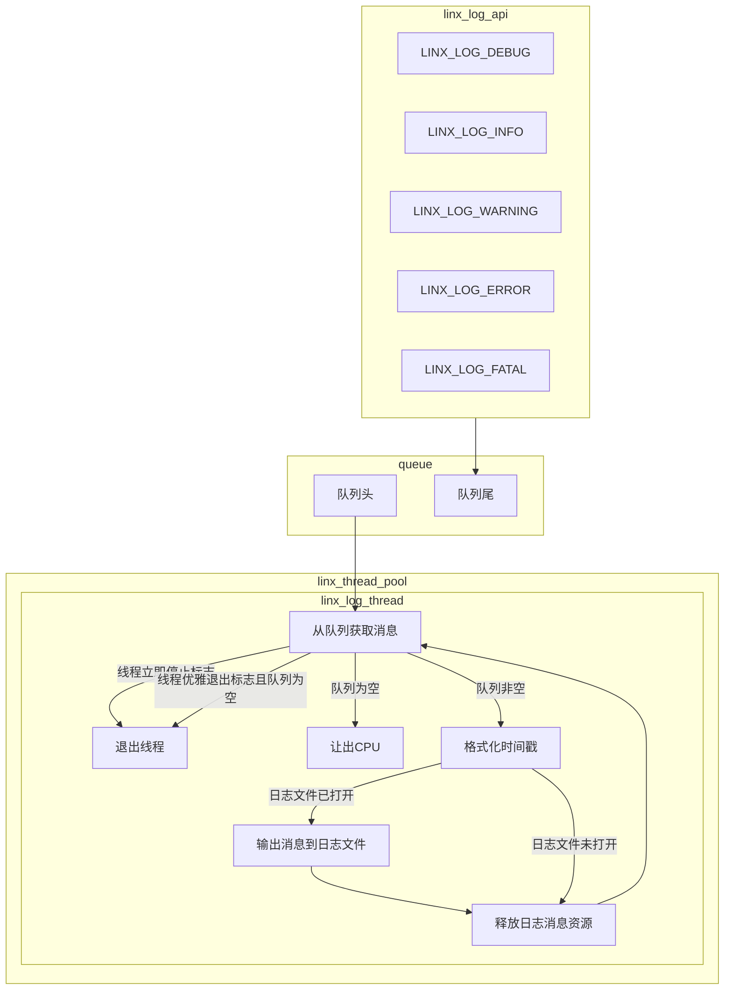

#### linx_process_cache

默认创建4个线程数的线程池，由位于`userspace/linx_process_cache/include/linx_process_cache_define.h`的`LINX_PROCESS_CACHE_THREAD_NUM`宏定义，在初始化时会默认添加两个死循环任务`monitor_thread_func`和`cleaner_thread_func`：

- `monitor_thread_func`：打开`/proc`文件系统，读取当前系统所有进程对应的`pid`，将`pid`作为参数创建`update_process_task`任务，将`pid`对应进程信息缓存到内部结构体中，一次全量扫描后线程休眠1秒（由LINX_PROCESS_CACHE_UPDATE_INTERVAL指定）。
- `cleaner_thread_func`：查找进程缓存中已经退出的进程，并且退出时间超过20秒（由LINX_PROCESS_CACHE_EXPIRE_TIME指定），将其从内部结构体中删除。

在初始化时已经使用了2个线程，剩下的两个线程主要用于完成`update_process_task`任务，创建`update_process_task`任务有两种途径：

- 若在`monitor_thread_func`线程中从`/proc`读取到有效的`pid`，则会创建`update_process_task`任务
- 在系统运行过程中主动调用`linx_process_cache_update_async`接口，会根据传入的`pid`参数创建`update_process_task`任务

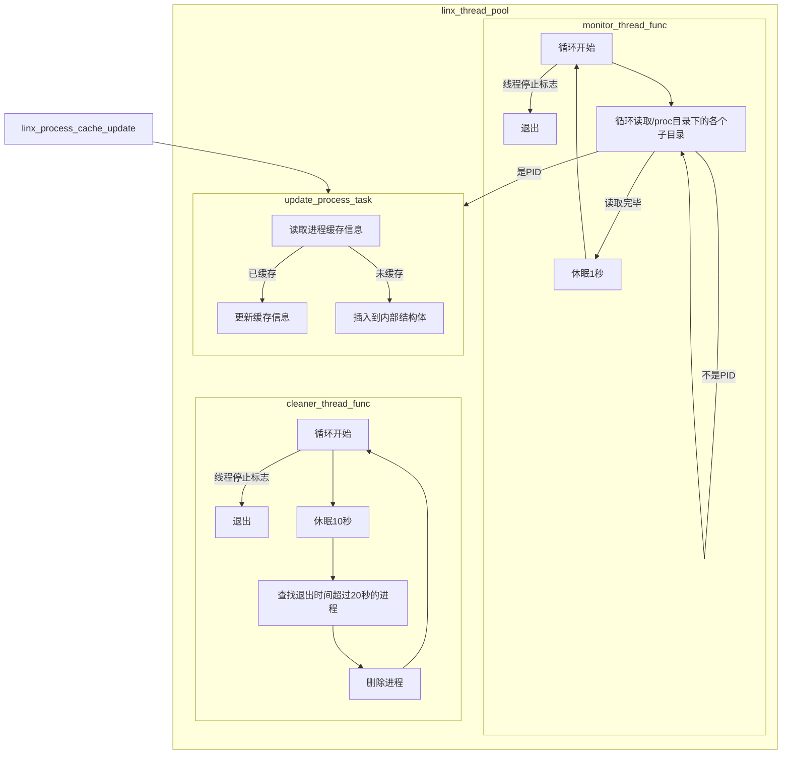

#### linx_alert

默认创建4个线程数的线程池，调用`linx_alert_init`函数时，第一个参数即为线程数，若传入数量不合理，依旧创建4个线程数的线程池。当规则匹配成功后会默认调用`linx_alert_send_async`函数发送输出，在该函数内则会创建`linx_alert_worker_task`任务，该任务通过输出配置，将信息发送到不同平台上。

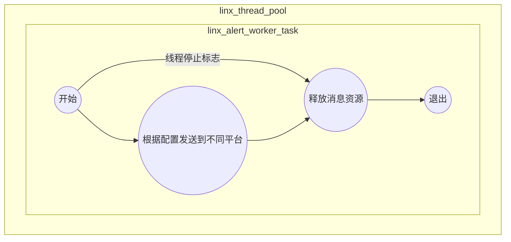


## linx_yaml

### 简介

该模块是系统的YAML文件解析模块，提供统一的YAML解析接口。核心功能：

- YAML解析：解析YAML格式的文件
- 节点操作：提供YAML节点的增删查改操作
- 错误处理：详细的解析错误信息和位置定位

代码结构如下：

```bash
.
├── include
│   ├── linx_yaml_get.h
│   ├── linx_yaml.h
│   ├── linx_yaml_load.h
│   ├── linx_yaml_node.h
│   └── linx_yaml_stack.h
├── linx_yaml_get.c
├── linx_yaml_load.c
├── linx_yaml_node.c
├── linx_yaml_stack.c
├── Makefile
└── README.md
```

### 核心接口

```c
// 加载yaml文件
linx_yaml_node_t *linx_yaml_load(const char *config_file);

// 节点访问c
const char *linx_yaml_get_string(linx_yaml_node_t *root, const char *path, const char *default_value);
int linx_yaml_get_int(linx_yaml_node_t *root, const char *path, int default_value);
int linx_yaml_get_bool(linx_yaml_node_t *root, const char *path, int default_value);
```

# 各模块缺陷

## linx_arg_parser

当前支持的参数不够

## linx_config

当前提供的配置不够

## linx_log

当前只能配置输出到文件或stderr

## linx_process_cache

进程缓存对于极短时间的进程缓存不到

## linx_event_rich

目前对上下文的丰富不够完整

## linx_alert

当前只能输出到stdout，其余目标未实现

## linx_rule_engine

当前解析规则不支持val()和跟参数的情况

## linx_engine

当前只支持ebpf

# 支持的字段

| 表名  | 字段名    | 简介                              |
| ----- | --------- | --------------------------------- |
| evt   | num       | 事件编号，并不是系统调用号        |
|       | time      | 时间戳字符串，包含纳秒            |
|       | type      | 系统调用名称                      |
|       | args      | 所有参数聚合为一个字符串          |
|       | res       | 成功是SUCCESS，失败是错误码字符串 |
|       | rawres    | 返回值的实际值                    |
|       | failed    | 失败的事件，该值为true            |
|       | dir       | > 进入，< 退出                    |
| proc  | pid       |                                   |
|       | ppid      |                                   |
|       | pgid      |                                   |
|       | sid       |                                   |
|       | uid       |                                   |
|       | gid       |                                   |
|       | name      |                                   |
|       | comm      |                                   |
|       | cmdline   |                                   |
|       | exe       |                                   |
|       | cwd       |                                   |
| user  | uid       |                                   |
|       | name      |                                   |
|       | homedir   |                                   |
|       | shell     |                                   |
|       | loginuid  |                                   |
|       | loginname |                                   |
| group | gid       |                                   |
|       | name      |                                   |


# Demo规则中使用到的字段

| 字段         | 字段             | 字段        | 字段          |
| ------------ | ---------------- | ----------- | ------------- |
| proc.name    | evt.type         | fd.typechar | user.loginuid |
| proc.pid     | evt.buffer       | fd.l4proto  | user.name     |
| proc.ppid    | evt.arg.env      | fd.cip      |               |
| proc.cmdline | evt.dir          | fd.rport    |               |
| proc.pname   | evt.arg.data     | fd.lport    |               |
| proc.aname   | evt.arg.flags    | fd.name     |               |
| proc.args    | evt.num          | fd.filename |               |
| proc.exepath | evt.rawres       | fd.snet     |               |
|              | evt.args         | fd.net      |               |
|              | evt.time         | fd.type     |               |
|              | evt.arg.res      |             |               |
|              | evt.arg.loginuid |             |               |
|              | evt.arg.pgid     |             |               |


# 整个系统遗留缺陷

1. 目前事件循环处于主进程的一个死循环中，规则匹配未使用多线程，导致性能低下。

2. 当前事件丰富模块比较局限，没有对特定的系统调用进行上下文丰富。

3. 当前进程缓存是由线程实现的，线程需要CPU调度，所以某些运行时间极短的进程是缓存不到的，这就导致在规则匹配时无法匹配对应的信息，导致规则匹配失败。

   解决方案：修改内核采集参数，一般是execv，在该系统调用中采集pid、命令名称等信息，当事件上传到应用层时，在通过事件丰富更新进程缓存。

4. 目前ebpf定义了字段类型，linx_apd也定义了字段类型，暂未统一。(完成)

5. 当前YAML解析不支持宏替换以及定义列表的操作。

6. 规则解析流程中还不支持val()替换，不支持规则字段跟上参数的操作。(可以解析为ast树，还不支持转换为匹配代码，需要修改match_context的逻辑)

7. 当前支持了部分判断逻辑，or、and、not、>、>=、<、<=、= 、!=、contains、icontains、startswith、endswith、in。

8. 规则匹配后的输出，当前只支持输出到stdout。

9. 数据引擎目前支持ebpf和kmod，但是采集上的结构还未统一；未实现插件框架代码。

10. 命令行参数当前支持-c和-r。

11. YAML配置文件内配置不够丰富。

12. 规则字段提供不完整，目前只有evt和proc，并且部分字段没有实现，例如evt.args。

13. 资源回收有缺陷，导致使用ctrl + c时会出现段错误。(解决)

14. 当前 linx_event_table_t 是以系统调用号 * 2 作为数组的总数量的，但是系统调用号并不是连续的，所以导致数组中的某一个可能没有初始化，其中的数据全为空，若访问可能出现问题。

15. sendto、recvfrom 、read、write逻辑没有完全疏通，因为都涉及到网络，所以需要后面在弄。

# 开发计划

## 现阶段需要的系统调用

| 系统调用 | 进入采集 | 退出采集 |
| -------- | -------- | -------- |
| execv    |          |          |
| sendto   |          |          |
| recvfrom |          |          |
| write    |          |          |
| read     |          |          |
| openat   |          |          |
| dup      |          |          |
| dup2     |          |          |
| dup3     |          |          |

