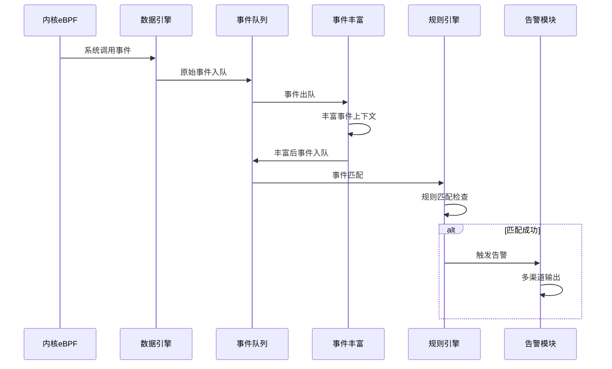
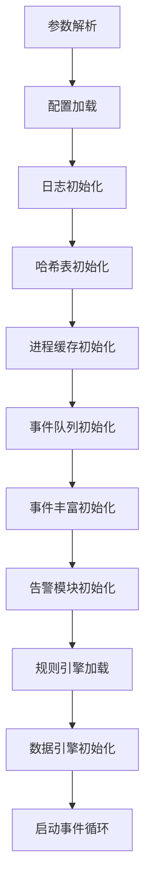

# LINX APD - Linux Advanced Process Defense

## 📋 项目简介

**LINX APD**（Linux Advanced Process Defense）是一个基于eBPF技术的Linux系统实时安全监控和威胁检测系统。该系统通过内核级别的数据采集，结合用户态的规则引擎和事件处理框架，提供全方位的系统行为监控、异常检测和威胁响应能力。

### 🎯 核心特性

- **实时监控**：基于eBPF技术，提供低开销的内核级别系统调用监控
- **规则引擎**：支持YAML格式的灵活规则配置，内置威胁检测规则库
- **事件丰富**：自动丰富事件上下文信息，包括进程树、文件信息等
- **多种输出**：支持文件、HTTP、Syslog、控制台等多种告警输出方式
- **模块化设计**：高度模块化的架构，易于扩展和维护
- **高性能**：多线程设计，支持高并发事件处理

### 🏗️ 技术架构

```
┌─────────────────────────────────────────────────────────────┐
│                      用户态 (Userspace)                     │
├─────────────────────────────────────────────────────────────┤
│  linx_apd (主程序)                                          │
│  ├── 参数解析 → 配置加载 → 规则加载 → 引擎初始化           │
│  └── 事件循环 → 事件丰富 → 规则匹配 → 告警输出             │
├─────────────────────────────────────────────────────────────┤
│                      内核态 (Kernel)                        │
│  ├── eBPF Programs (syscall_enter/exit)                    │
│  ├── Ring Buffer (零拷贝数据传输)                           │
│  └── Kernel Module (备选方案)                               │
└─────────────────────────────────────────────────────────────┘
```

## 📁 目录结构

```
linx_apd/
├── 📂 cmake/                    # CMake构建配置
├── 📂 include/                  # 公共头文件
│   ├── linx_event.h            # 事件结构定义
│   ├── linx_type.h             # 类型定义
│   └── linx_common.h           # 通用定义
├── 📂 kernel/                   # 内核模块
│   ├── ebpf/                   # eBPF程序
│   └── kmod/                   # 内核模块(备选)
├── 📂 userspace/               # 用户态模块
│   ├── linx_apd/               # 主程序
│   ├── linx_engine/            # 数据采集引擎
│   ├── linx_rule_engine/       # 规则引擎
│   ├── linx_alert/             # 告警模块
│   ├── linx_event_rich/        # 事件丰富
│   ├── linx_event_queue/       # 事件队列
│   ├── linx_config/            # 配置管理
│   ├── linx_thread/            # 线程管理
│   ├── linx_process_cache/     # 进程缓存
│   ├── linx_yaml/              # YAML解析
│   └── [其他模块...]
├── 📂 yaml_config/             # 配置文件
│   ├── linx_apd_config/        # 主配置
│   └── linx_apd_rules/         # 检测规则
├── 📂 json_config/             # JSON配置
├── 📂 local_depends/           # 本地依赖库
├── 📂 scripts/                 # 脚本工具
├── 📂 test/                    # 测试文件
├── Makefile                    # 构建文件
└── README.md                   # 项目文档
```

## 🧩 核心模块详细描述

### 1. 内核数据采集层 (Kernel Layer)

#### 📍 kernel/ebpf/ - eBPF数据采集模块
- **功能**：通过eBPF程序在内核态拦截系统调用
- **核心文件**：
  - `syscall_enter.bpf.c` - 系统调用进入点监控
  - `syscall_exit.bpf.c` - 系统调用退出点监控
- **数据流**：系统调用 → eBPF Hook → Ring Buffer → 用户态
- **特点**：低开销、实时性强、内核级别监控

### 2. 数据采集引擎 (Data Collection Engine)

#### 📍 userspace/linx_engine/ - 数据采集引擎
- **功能**：抽象数据源接口，支持多种驱动（eBPF、内核模块、插件等）
- **子模块**：
  - `ebpf/` - eBPF程序加载和管理
  - `kmod/` - 内核模块支持
  - `plugin/` - 插件框架
- **接口标准**：
```c
typedef struct {
    int (*init)();      // 初始化
    int (*destroy)();   // 销毁
    int (*next)();      // 获取下一个事件
    int (*get_msg)();   // 获取消息
} linx_data_source_t;
```

### 3. 事件处理层 (Event Processing Layer)

#### 📍 userspace/linx_event_queue/ - 事件队列管理
- **功能**：管理从内核态上传的事件消息
- **特性**：
  - Ring Buffer支持零拷贝传输
  - 流量控制机制
  - 多线程安全

#### 📍 userspace/linx_event_rich/ - 事件上下文丰富
- **功能**：为原始事件添加丰富的上下文信息
- **丰富内容**：
  - 进程树构建
  - 文件哈希计算
  - DNS反向解析
  - 进程详细信息

### 4. 规则引擎层 (Rule Engine Layer)

#### 📍 userspace/linx_rule_engine/ - 规则引擎核心
- **功能**：将YAML规则转换为可执行的检测逻辑
- **子模块**：
  - `rule_engine_load/` - 规则加载
  - `rule_engine_match/` - 规则匹配
  - `rule_engine_ast/` - 抽象语法树
  - `rule_engine_lexer/` - 词法分析
  - `rule_engine_set/` - 规则集合管理

#### 规则引擎工作流程


### 5. 告警输出层 (Alert Output Layer)

#### 📍 userspace/linx_alert/ - 告警管理模块
- **功能**：多渠道告警输出和行为阻断
- **支持的输出方式**：
  - `file/` - 文件输出
  - `http/` - HTTP接口输出
  - `syslog/` - 系统日志输出
  - `stdout/` - 控制台输出
  - `executor/` - 行为阻断（规划中）

### 6. 支撑服务层 (Support Services Layer)

#### 📍 userspace/linx_config/ - 配置管理
- **功能**：解析`linx_apd.yaml`总体配置，支持热更新
- **特性**：配置文件监控、动态重载

#### 📍 userspace/linx_process_cache/ - 进程缓存
- **功能**：缓存进程相关信息，提高查询效率
- **子模块**：
  - `proc_scanner` - 实时扫描/proc
  - `lru_cache` - 进程信息LRU缓存

#### 📍 userspace/linx_thread/ - 线程管理
- **功能**：为其他模块提供线程服务
- **子模块**：
  - `thread_pool` - 线程池管理
  - `scheduler` - 任务调度器

#### 📍 userspace/linx_yaml/ - YAML解析
- **功能**：提供YAML文件解析能力
- **应用**：配置文件解析、规则文件解析

### 7. 工具模块 (Utility Modules)

#### 📍 userspace/linx_hash_map/ - 哈希表工具
- **功能**：提供高效的哈希表数据结构

#### 📍 userspace/linx_regex/ - 正则表达式
- **功能**：支持规则中的正则匹配

#### 📍 userspace/linx_log/ - 日志管理
- **功能**：统一的日志输出管理
- **特性**：结构化日志、日志轮转、多级别输出

## 🔄 模块间交互关系

### 主要数据流



### 初始化依赖关系



### 线程模型

```
主线程
├── 事件采集线程 (CPU核数个)
├── 事件处理线程 (CPU核数×2个)
├── 规则匹配线程 (CPU核数×2个)
├── 告警输出线程 (4个)
└── 进程缓存线程 (1个)
```

## 📊 事件数据格式

### 内核事件结构
```c
typedef struct {
    uint64_t    tid;                    // 线程ID
    uint64_t    pid;                    // 进程ID
    uint64_t    ppid;                   // 父进程ID
    uint64_t    uid;                    // 用户ID
    uint64_t    gid;                    // 组ID
    uint64_t    time;                   // 时间戳
    uint64_t    res;                    // 系统调用返回值
    uint8_t     type;                   // 进入/退出标识
    uint32_t    syscall_id;             // 系统调用号
    uint32_t    nparams;                // 参数个数
    uint32_t    nfds;                   // 文件描述符个数
    uint32_t    fds[LINX_FDS_MAX_SIZE]; // 文件描述符数组
    char        fd_path[LINX_FDS_MAX_SIZE][LINX_PATH_MAX_SIZE]; // 文件路径
    char        comm[LINX_COMM_MAX_SIZE];     // 命令名
    char        cmdline[LINX_CMDLINE_MAX_SIZE]; // 命令行
    char        fullpath[LINX_PATH_MAX_SIZE];   // 命令绝对路径
    char        p_fullpath[LINX_PATH_MAX_SIZE]; // 父进程绝对路径
    uint64_t    params_size[SYSCALL_PARAMS_MAX_COUNT]; // 参数长度
} linx_event_t;
```

## ⚙️ 构建和使用

### 依赖库
- **libyaml** - YAML解析
- **pcre2** - 正则表达式
- **cJSON** - JSON解析  
- **uthash** - 哈希表
- **libbpf** - eBPF支持

### 编译构建
```bash
# 编译所有模块
make all

# 仅编译eBPF模块
make ebpf

# 仅编译主程序
make linx_apd

# 清理编译文件
make clean
```

### 运行配置
```bash
# 使用默认配置运行
./build/bin/linx-apd

# 指定配置文件运行
./build/bin/linx-apd -c /path/to/config.yaml -r /path/to/rules.yaml
```

## 📋 规则示例

```yaml
- rule: Passwd File Access by File Open
  desc: Detect direct file open of sensitive files by known read tools
  condition: >
    evt.type = execve and
    proc.name in (vim, vi, nvim, cat, less, more, tail, head) and
    proc.args = "/etc/passwd" and
    proc.cmdline contains "/etc/passwd"
  output: >
    [ALERT] %evt.time User=%user.name opened sensitive file %fd.name 
    using %proc.name (%proc.cmdline pid=%proc.pid ppid=%proc.ppid)
  priority: WARNING
  tags: [filesystem, sensitive]
  notify:
    title: 敏感文件读取
    content: 命令行读取/etc/passwd行为，请确认是否为合法操作
```

## 🚀 发展规划

### 当前状态
- ✅ eBPF内核数据采集
- ✅ 基础规则引擎
- ✅ 多种告警输出
- ✅ 事件上下文丰富
- ✅ 基础威胁检测规则

### 待完善功能
- 🔄 多线程性能优化
- 🔄 规则引擎高级特性（宏替换、列表操作）
- 🔄 行为阻断能力
- 🔄 插件系统完善
- 🔄 Kubernetes集成
- 🔄 Web管理界面

## 🤝 贡献指南

我们欢迎社区贡献！请遵循以下步骤：

1. Fork本项目
2. 创建特性分支
3. 提交更改
4. 创建Pull Request

## 📄 许可证

本项目采用开源许可证，具体信息请参考LICENSE文件。

---

**LINX APD** - 让Linux系统安全监控更智能、更高效！

