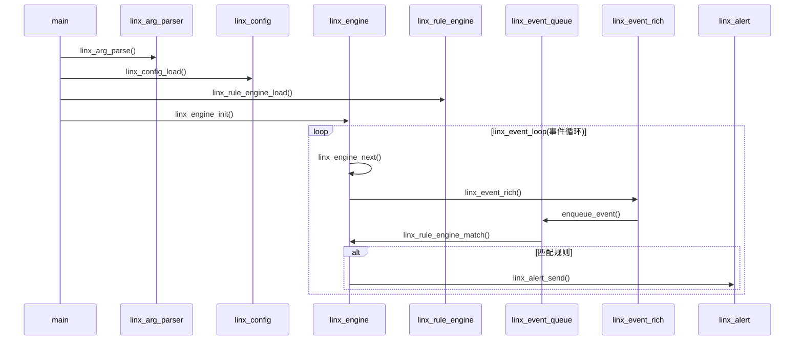

# 简介

`linx_apd`

## 目录结构

`linx_apd`采用`层级`->`主模块`->`子模块`的三级目录结构来划分，计划各个层级，各个主模块以及子模块划分如下：

| 层级      | 主模块             | 子模块         | 功能简介                                                     |
| --------- | ------------------ | -------------- | ------------------------------------------------------------ |
| kernle    |                    |                |                                                              |
|           | ebpf               |                | 内核采集系统调用、网络等信息                                 |
|           | kmod               |                | 内核采集系统调用、网络等信息                                 |
| userspace |                    |                |                                                              |
|           | linx_alert         |                | 该模块用于发送警告日志和行为阻断                             |
|           |                    | file           | 警告发送到文件                                               |
|           |                    | http           | 警告发送到http                                               |
|           |                    | stdout         | 警告发送到控制台                                             |
|           |                    | executor       | 行为阻断                                                     |
|           | linx_arg_parser    |                | 该模块用于解析命令行参数                                     |
|           | linx_config        |                | 该模块用于解析linx_apd.yaml的总体配置并且支持热更新          |
|           | linx_engine        |                | 该模块主要用于管理所有事件源的加载/卸载，以及从事件源读取消息 |
|           |                    | ebpf           | 动态加载ebpf                                                 |
|           |                    | kmod           | 动态加载内核模块                                             |
|           |                    | plugin         | 插件管理框架                                                 |
|           |                    | k8s或者webhook |                                                              |
|           | linx_event_queue   |                | 该模块用于管理事件源上传来的消息                             |
|           |                    | ringbuffer     | 内核-用户态零拷贝传输                                        |
|           |                    | flow_control   | 流量控制                                                     |
|           | linx_event_rich    |                | 该模块主要用于丰富事件上下文                                 |
|           |                    | process_tree   | 进程树构建                                                   |
|           |                    | file_hasher    | 文件哈希计算                                                 |
|           |                    | dns_resolver   | DNS反向解析                                                  |
|           | linx_log           |                | 该模块管理所有模块的日志输出                                 |
|           |                    | structured_log | 结构化日志                                                   |
|           |                    | log_rotator    | 日志轮转压缩                                                 |
|           |                    | log_output     | 日志输出，可选文件、stdout等                                 |
|           | linx_process_cache |                | 该模块用于读取/proc缓存进程相关信息                          |
|           |                    | proc_scanner   | 实时扫描/proc                                                |
|           |                    | lru_cache      | 进程信息缓存                                                 |
|           | linx_rule_engine   |                | 该模块负责规则解析（YAML->内部结构）                         |
|           |                    | ast            | 抽象语法树                                                   |
|           |                    | check          | 语法检查                                                     |
|           |                    | load           | 规则加载                                                     |
|           |                    | match          | 规则匹配                                                     |
|           |                    | set            | 规则集合                                                     |
|           | linx_thread        |                | 该模块负责为其他模块创建线程                                 |
|           |                    | thread_pool    | 线程池                                                       |
|           |                    | scheduler      | 调度器                                                       |
|           | linx_yaml          |                | 该模块用于解析YAML文件                                       |

## 大致执行流程




## 内核采集消息格式

大致格式如下：

```tex
[linx_evt_hdr_t（头部信息），参数值1, 参数值2, ...]
```

头部信息结构体定义如下：

```c
typedef struct {
	uint32_t		tid;			/* tid */
	uint32_t		pid;			/* pid */
	uint64_t		ppid;
	uint32_t		uid;			/* 尝试 */
	uint32_t		gid;			/* 尝试 */
	uint64_t		time;
	linx_evt_type_t event_type;		/* 应用层内核通用枚举字段 */
	uint64_t		len;			/* 整个消息的长度 */
	uint64_t		res;			/* 系统调用返回值，系统调用进入时该值为0 */
	uint32_t		nparams;		/* 传出的参数数量 */
	uint64_t		params_size[32];/* 每个参数的长度 */
	char			comm[32];		/* 命令本身 */
	char			cmdline[128];   /* 完整命令(命令+参数) */
} linx_evt_hdr_t;
```

计划后续是否添加尾部信息，用于扩展消息：

```c
typedef struct {
	int 			nfds;
	int 			fds[12];
	char			fds_path[12][256];
	char 			abscmd[128];		/* 命令的绝对路径 */
} linx_evt_tail_t;
```

统计信息结构体，用于标识采集了多少事件，丢弃了多少事件

```c
typedef struct {
	uint64_t	n_events;	/* 采集了多少事件 */
	uint64_t	n_drops;	/* 丢弃了多少事件 */
} linx_evt_msg_t;
```

## 内核采集模块

```
typedef struct {
	int (*init)();
	int (*destroy)();
	int (*next)();
	int (*get_msg)();
} linx_data_source_t;
```


# 思路备忘

规则解析的实现方式可以如下：

首先将所有规则都解析为AST，一个规则对应一个AST，将所有AST存放在一个集合中。

当内核采集数据到应用层时，通过遍历AST集合，对每一个AST进行遍历，遍历过程主要是将规则字段对应的数据取出，然后进行条件判断，若为真则表明该规则触发，取该规则的output字段，输出到对应目标。

这里最关键的就是规则字段和数据的绑定，规则字段具有proc、evt、fd等类型，每个类型都具有子集，例如evt.type，proc.name；计划将类型定义一个结构体，结构体内部是各个子集，随后使用uthash绑定键值对，键是规则字段字符串，值是实际数据在结构体内部的地址偏移，通过uthash可以在O(1)的复杂度下通过键查找到值，这样条件判断和条件满足后的输出就可以完成了。

但在运行过程中，怎么知道要匹配那个规则呢？，还是需要将所有规则遍历完才行。

由于事件众多，期望事件采集由CPU核数的线程进行采集，规则匹配由CPU核数×2进行匹配，这中间资源共享也是一个问题。

解决办法：
	1. 内核采集的数据通过会有一个序号标识是什么事件，定义一个结构体，事件序号为下标，内容为该事件要采集那些数据，在进行规则条件遍历时，先判断该规则AST中使用到的规则字段是否是该事件要采集参数的子集，若是，则进行后续的条件判断，若不是，则跳过。
	2. 在编译一次ast，将ast编译为可执行的函数序列，这样只需要每次都执行该函数序列即可。

本周计划：
	1. 将BPF内核编译通过并且使用使用engine可以加载bpf （完成）
	2. 将bpf采集的内容映射到evt结构体上			（完成）
	3. 看规则输出是否能采集到evt结构体的内容	（完成）
	4. 现在要修改一下实现逻辑：内核采集数据后，需要通过linx_event_rich模块
	   将内核的数据通过丰富，更新到真正的evt结构体中，这样规则匹配和输出时就能获取到真正的数据了
	   即在linx_event_rich中定义一个真正的evt结构体 (完成)
	5. 目前存在一个问题，就是结构提是uint64存储的，但是在规则中使用了 = 进行判断，
	   但是在使用 = 时，ast类型是字符串类型，这样在进行比较时，会出现错误的情况。
	6. 优先将事件获取以及事件匹配的多线程创建出来，优先搭建好架子，后续再处理上面的问题以及扩展功能。
	7. proc的缓存功能，以提供proc字段的提取功能
	8. 统一代码内的字段类型，如FIELD_TYPE_INT8等，用唯一的标识符来处理所有的字段类型
