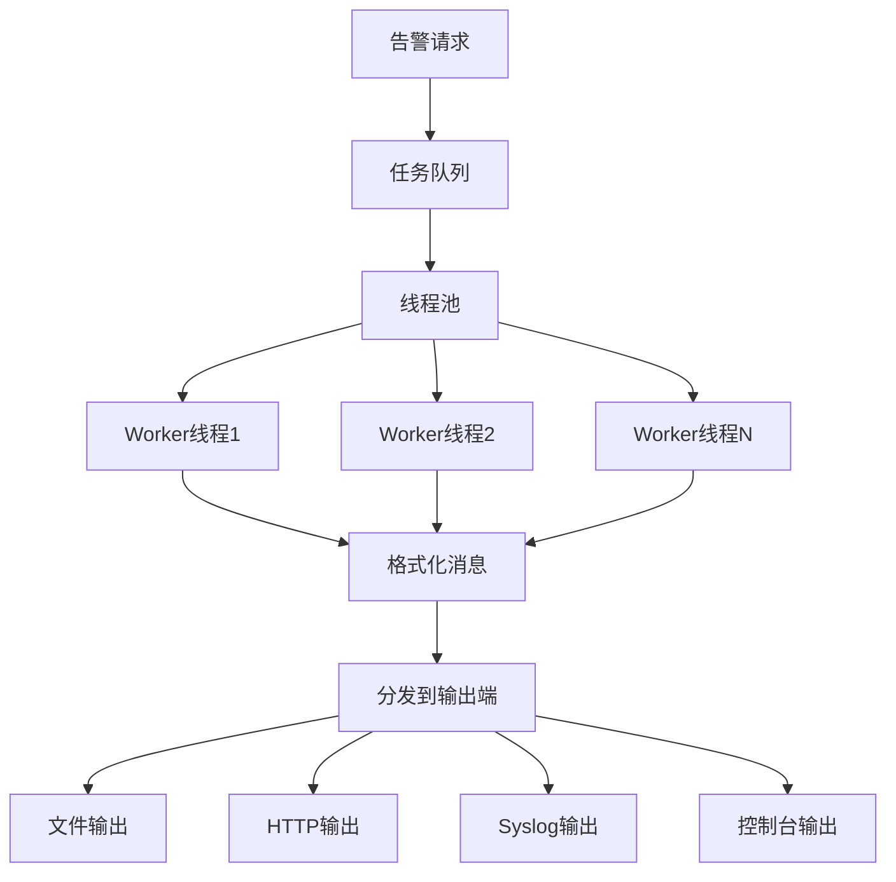

# LINX Alert - 告警输出模块

## 📋 模块概述

`linx_alert` 是系统的告警输出模块，负责将规则匹配结果格式化并输出到不同的目标渠道。支持多种输出方式，包括文件、HTTP接口、系统日志、控制台输出等，并提供行为阻断能力。

## 🎯 核心功能

- **多渠道输出**: 支持文件、HTTP、Syslog、控制台等多种输出方式
- **异步处理**: 基于线程池的异步告警处理机制
- **格式化输出**: 灵活的消息格式化和模板处理
- **统计监控**: 详细的发送统计和失败监控
- **配置管理**: 动态配置各个输出渠道的参数

## 🏗️ 模块结构

```
linx_alert/
├── include/
│   └── linx_alert.h            # 主要接口定义
├── file/
│   └── linx_alert_file.c       # 文件输出实现
├── http/
│   └── linx_alert_http.c       # HTTP输出实现
├── syslog/
│   └── linx_alert_syslog.c     # Syslog输出实现
├── stdout/
│   └── linx_alert_stdout.c     # 控制台输出实现
├── linx_alert.c                # 核心管理模块
└── Makefile                    # 构建配置
```

## 🔧 核心接口

### 主要API

```c
// 初始化和清理
int linx_alert_init(int thread_pool_size);
void linx_alert_deinit(void);

// 配置管理
int linx_alert_set_config_enable(linx_alert_type_t type, bool enable);
int linx_alert_update_config(linx_alert_config_t config);

// 告警发送
int linx_alert_send_async(linx_output_match_t *output, const char *rule_name, int priority);
int linx_alert_send_sync(linx_output_match_t *output, const char *rule_name, int priority);
int linx_alert_format_and_send(linx_output_match_t *output, const char *rule_name, int priority);

// 统计信息
void linx_alert_get_stats(long *total_send, long *total_fail);
```

### 告警类型定义

```c
typedef enum {
    LINX_ALERT_TYPE_STDOUT,     // 控制台输出
    LINX_ALERT_TYPE_FILE,       // 文件输出
    LINX_ALERT_TYPE_HTTP,       // HTTP接口输出
    LINX_ALERT_TYPE_SYSLOG,     // 系统日志输出
    LINX_ALERT_TYPE_MAX
} linx_alert_type_t;
```

### 配置结构

```c
typedef struct {
    linx_alert_type_t type;     // 告警类型
    bool enabled;               // 是否启用
    union {
        struct {
            bool use_color;     // 是否使用颜色
        } stdout_config;
        
        struct {
            char *file_path;    // 文件路径
        } file_config;
        
        struct {
            char *url;          // HTTP URL
            char *headers;      // HTTP头部
        } http_config;
        
        struct {
            int facility;       // Syslog设施
        } syslog_config;
    } config;
} linx_alert_config_t;
```

### 告警消息结构

```c
typedef struct {
    char *message;              // 格式化后的消息
    size_t message_len;         // 消息长度
    linx_alert_config_t config[LINX_ALERT_TYPE_MAX]; // 输出配置
    char *rule_name;            // 规则名称
    int priority;               // 优先级
} linx_alert_message_t;
```

## 📤 输出子模块

### 📄 文件输出 (file/)

#### 功能特性
- **文件轮转**: 支持文件大小和时间轮转
- **原子写入**: 保证写入操作的原子性
- **缓冲写入**: 批量写入优化性能
- **权限控制**: 安全的文件权限设置

#### 配置选项
```yaml
alert:
  file:
    enabled: true
    file_path: "/var/log/linx_apd/alerts.log"
    max_size: "100MB"
    max_files: 10
    compress: true
```

#### 输出格式
```
[2024-01-15 10:30:45] [WARNING] [rule:passwd_access] User=root opened sensitive file /etc/passwd using cat (pid=1234)
```

### 🌐 HTTP输出 (http/)

#### 功能特性
- **RESTful API**: 标准的HTTP POST请求
- **重试机制**: 失败自动重试
- **批量发送**: 支持批量告警发送
- **认证支持**: 支持多种HTTP认证方式

#### 配置选项
```yaml
alert:
  http:
    enabled: true
    url: "https://api.example.com/alerts"
    method: "POST"
    headers:
      Content-Type: "application/json"
      Authorization: "Bearer token123"
    timeout: 30
    retry_count: 3
```

#### 请求格式
```json
{
    "timestamp": "2024-01-15T10:30:45Z",
    "rule_name": "passwd_access",
    "priority": "WARNING",
    "message": "User=root opened sensitive file /etc/passwd",
    "tags": ["filesystem", "sensitive"],
    "event": {
        "pid": 1234,
        "proc_name": "cat",
        "user": "root"
    }
}
```

### 📋 Syslog输出 (syslog/)

#### 功能特性
- **标准兼容**: 完全兼容RFC 3164/5424标准
- **设施映射**: 支持不同的Syslog设施
- **优先级映射**: 自动映射告警优先级
- **本地/远程**: 支持本地和远程Syslog服务器

#### 配置选项
```yaml
alert:
  syslog:
    enabled: true
    facility: "LOG_SECURITY"
    server: "syslog.example.com"
    port: 514
    protocol: "udp"
```

#### 输出格式
```
Jan 15 10:30:45 hostname linx_apd[1234]: [WARNING] passwd_access: User=root opened sensitive file /etc/passwd
```

### 🖥️ 控制台输出 (stdout/)

#### 功能特性
- **彩色输出**: 基于优先级的颜色编码
- **格式化**: 美观的控制台格式
- **实时输出**: 实时显示告警信息
- **调试模式**: 详细的调试信息输出

#### 配置选项
```yaml
alert:
  stdout:
    enabled: true
    use_color: true
    show_timestamp: true
    show_rule_name: true
```

#### 输出效果
```bash
🔴 [WARNING] 10:30:45 passwd_access
   User=root opened sensitive file /etc/passwd using cat (pid=1234)
```

## ⚡ 异步处理机制

### 线程池架构



### 任务管理

```c
typedef struct linx_task_s {
    void *(*func)(void *, int *);   // 任务函数
    void *arg;                      // 任务参数
    int should_stop;                // 停止标志
    struct linx_task_s *next;       // 下一个任务
} linx_task_t;
```

### 性能优化
- **批量处理**: 批量发送多个告警
- **缓存池**: 重用告警消息对象
- **负载均衡**: 智能分配线程任务
- **背压控制**: 防止任务队列过载

## 📊 统计和监控

### 核心指标

```c
typedef struct {
    long total_alerts_send;     // 总发送数量
    long total_alerts_failed;   // 总失败数量
    long alerts_per_second;     // 每秒告警数
    long avg_process_time;      // 平均处理时间
    pthread_mutex_t stats_mutex; // 统计互斥锁
} linx_alert_stats_t;
```

### 监控信息
- **发送成功率**: 各个输出渠道的成功率
- **处理延迟**: 从接收到发送的延迟时间
- **队列深度**: 当前任务队列的深度
- **线程状态**: 各个工作线程的状态

### 性能报告
```bash
Alert Statistics:
  Total Sent: 15,234
  Total Failed: 42
  Success Rate: 99.72%
  Avg Latency: 23ms
  Queue Depth: 5
  Active Threads: 4/4
```

## 🔧 配置管理

### 配置文件示例

```yaml
alert:
  # 线程池配置
  thread_pool_size: 4
  queue_max_size: 1000
  
  # 输出渠道配置
  outputs:
    stdout:
      enabled: true
      use_color: true
      priority_filter: ["WARNING", "ERROR", "CRITICAL"]
      
    file:
      enabled: true
      file_path: "/var/log/linx_apd/alerts.log"
      max_size: "100MB"
      max_files: 10
      format: "json"
      
    http:
      enabled: false
      url: "https://webhook.example.com/alerts"
      headers:
        Content-Type: "application/json"
        X-API-Key: "your-api-key"
      timeout: 30
      retry_count: 3
      
    syslog:
      enabled: true
      facility: "LOG_SECURITY"
      priority_mapping:
        DEBUG: "LOG_DEBUG"
        INFO: "LOG_INFO"
        WARNING: "LOG_WARNING"
        ERROR: "LOG_ERR"
        CRITICAL: "LOG_CRIT"
```

### 动态配置更新

```c
// 动态启用/禁用输出渠道
linx_alert_set_config_enable(LINX_ALERT_TYPE_HTTP, false);

// 更新配置
linx_alert_config_t new_config = {
    .type = LINX_ALERT_TYPE_FILE,
    .enabled = true,
    .config.file_config.file_path = "/new/path/alerts.log"
};
linx_alert_update_config(new_config);
```

## 🚨 错误处理和恢复

### 错误类型
- **网络错误**: HTTP请求失败
- **文件错误**: 文件写入失败
- **格式错误**: 消息格式化失败
- **配置错误**: 配置参数无效

### 恢复策略

#### 重试机制
```c
typedef struct {
    int max_retries;            // 最大重试次数
    int retry_delay;            // 重试延迟(秒)
    bool exponential_backoff;   // 指数退避
} retry_config_t;
```

#### 降级处理
1. **优先级降级**: HTTP失败时降级到文件输出
2. **缓存存储**: 网络异常时本地缓存
3. **异常告警**: 发送模块自身的异常告警
4. **优雅降级**: 保证核心功能不受影响

## 🔍 调试和故障排查

### 调试模式

```c
// 启用调试模式
linx_alert_set_debug_mode(true);

// 设置调试级别
linx_alert_set_debug_level(LINX_DEBUG_VERBOSE);
```

### 调试信息
- **消息追踪**: 追踪消息的完整处理流程
- **性能分析**: 详细的性能分析数据
- **错误堆栈**: 错误发生时的调用堆栈
- **内存使用**: 内存分配和释放情况

### 故障排查工具

```bash
# 查看告警统计
linx-apd-ctl alert stats

# 测试输出渠道
linx-apd-ctl alert test --type=http --message="test alert"

# 查看队列状态
linx-apd-ctl alert queue

# 重载配置
linx-apd-ctl alert reload
```

## 🔗 模块依赖

### 外部依赖
- **libcurl**: HTTP请求支持
- **pthread**: 线程池实现
- **cJSON**: JSON格式化

### 内部依赖
- `linx_thread` - 线程池管理
- `linx_rule_engine` - 规则匹配结果
- `linx_log` - 日志输出
- `linx_config` - 配置管理

## 📝 使用示例

### 基本使用

```c
#include "linx_alert.h"

// 初始化告警模块
int ret = linx_alert_init(4);  // 4个工作线程
if (ret != 0) {
    fprintf(stderr, "Failed to init alert module\n");
    return -1;
}

// 配置文件输出
linx_alert_config_t file_config = {
    .type = LINX_ALERT_TYPE_FILE,
    .enabled = true,
    .config.file_config.file_path = "/var/log/alerts.log"
};
linx_alert_update_config(file_config);

// 发送告警
linx_output_match_t *output = create_output_match("User %user.name accessed %fd.name");
linx_alert_send_async(output, "file_access_rule", PRIORITY_WARNING);

// 清理资源
linx_alert_deinit();
```

### 自定义输出处理器

```c
// 实现自定义输出函数
int custom_alert_output(linx_alert_message_t *message, linx_alert_config_t *config) {
    // 自定义处理逻辑
    printf("Custom Alert: %s\n", message->message);
    return 0;
}

// 注册自定义输出处理器
linx_alert_register_output_handler(LINX_ALERT_TYPE_CUSTOM, custom_alert_output);
```

## 🚀 扩展开发

### 添加新的输出渠道

1. **定义新类型**: 在`linx_alert_type_t`中添加新类型
2. **实现输出函数**: 按照标准接口实现输出逻辑
3. **添加配置支持**: 扩展配置结构和解析逻辑
4. **注册处理器**: 注册到告警模块

### 输出处理器接口

```c
typedef int (*linx_alert_output_func_t)(
    linx_alert_message_t *message,
    linx_alert_config_t *config
);
```

### 实现示例

```c
// 实现Slack输出
int linx_alert_output_slack(linx_alert_message_t *message, linx_alert_config_t *config) {
    // 构建Slack消息格式
    cJSON *json = cJSON_CreateObject();
    cJSON_AddStringToObject(json, "text", message->message);
    cJSON_AddStringToObject(json, "username", "LINX APD");
    
    // 发送到Slack Webhook
    char *json_string = cJSON_Print(json);
    int ret = http_post(config->config.slack_config.webhook_url, json_string);
    
    // 清理资源
    free(json_string);
    cJSON_Delete(json);
    
    return ret;
}
```