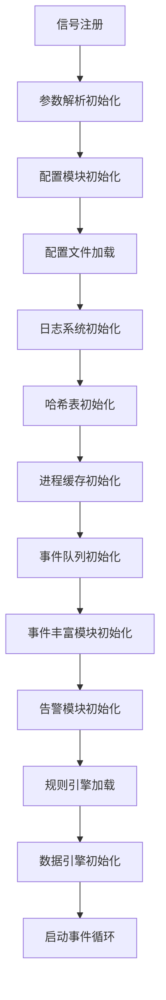
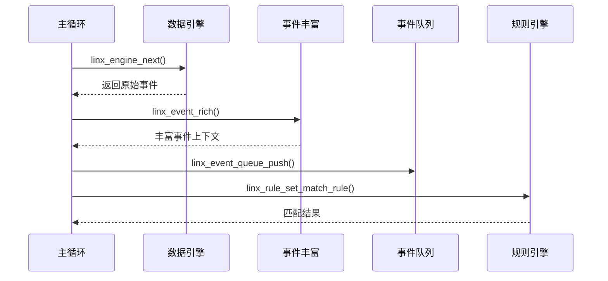

# LINX APD 主程序模块

## 📋 模块概述

`linx_apd` 是整个系统的主程序模块，负责统筹协调所有子模块的初始化、配置加载、事件循环管理和资源清理。它是系统的核心控制器，实现了完整的生命周期管理。

## 🎯 核心功能

- **启动流程管理**: 按照依赖关系顺序初始化各个模块
- **配置协调**: 集成参数解析和配置加载
- **事件循环**: 实现主要的事件处理循环
- **信号处理**: 优雅处理系统信号和资源清理
- **错误处理**: 统一的错误处理和回滚机制

## 🏗️ 模块结构

```
linx_apd/
├── include/
│   ├── linx_signal.h           # 信号处理
│   └── linx_resource_cleanup.h # 资源清理
├── linx_apd.c                  # 主程序入口
├── linx_signal.c               # 信号处理实现
├── linx_resource_cleanup.c     # 资源清理实现
└── Makefile                    # 构建配置
```

## 🔄 主要工作流程

### 初始化序列


### 事件循环流程


## 🛠️ 核心接口

### 主要函数

```c
int main(int argc, char *argv[]);
static int linx_event_loop(void);
```

### 资源清理类型

```c
typedef enum {
    LINX_RESOURCE_CLEANUP_ARGS,         // 参数解析资源
    LINX_RESOURCE_CLEANUP_CONFIG,       // 配置资源
    LINX_RESOURCE_CLEANUP_LOG,          // 日志资源
    LINX_RESOURCE_CLEANUP_HASH_MAP,     // 哈希表资源
    LINX_RESOURCE_CLEANUP_PROCESS_CACHE,// 进程缓存资源
    LINX_RESOURCE_CLEANUP_EVENT_QUEUE,  // 事件队列资源
    LINX_RESOURCE_CLEANUP_EVENT_RICH,   // 事件丰富资源
    LINX_RESOURCE_CLEANUP_ALERT,        // 告警模块资源
    LINX_RESOURCE_CLEANUP_RULE_ENGINE,  // 规则引擎资源
    LINX_RESOURCE_CLEANUP_ENGINE,       // 数据引擎资源
} linx_resource_cleanup_type_t;
```

## 🔧 信号处理

### 支持的信号
- **SIGINT**: 中断信号，触发优雅退出
- **SIGUSR1**: 用户信号，触发资源清理

### 信号处理函数
```c
void linx_setup_signal(int sig);           // 注册信号处理器
void linx_signal_handler(int sig);         // 信号处理函数
```

## 📊 资源管理

### 清理策略
- **递进式清理**: 按照初始化的逆序进行资源清理
- **异常安全**: 即使在初始化失败时也能正确清理已分配的资源
- **信号安全**: 通过信号触发的清理操作

### 清理函数
```c
linx_resource_cleanup_type_t *linx_resource_cleanup_get(void);
void linx_resource_cleanup_set(linx_resource_cleanup_type_t type);
```

## ⚙️ 配置参数

主程序通过命令行参数接收配置：

```bash
./linx-apd [OPTIONS]
  -c, --config=FILE     指定配置文件路径
  -r, --rules=FILE      指定规则文件路径
  -h, --help           显示帮助信息
  -v, --version        显示版本信息
```

## 🚨 错误处理

### 错误分类
- **初始化错误**: 模块初始化失败
- **配置错误**: 配置文件加载或解析失败
- **运行时错误**: 事件循环中的错误

### 错误处理机制
- 错误发生时立即停止初始化流程
- 自动执行已初始化模块的清理工作
- 向stderr输出详细错误信息
- 通过信号触发优雅退出

## 📈 性能特性

- **单线程主循环**: 避免复杂的线程同步
- **事件驱动**: 基于事件的非阻塞处理
- **模块化设计**: 各模块独立，便于性能优化
- **资源复用**: 高效的资源管理和复用机制

## 🔍 调试和监控

### 日志输出
- 各模块初始化状态
- 事件循环处理统计
- 错误和异常信息

### 状态监控
- 进程状态信息
- 模块运行状态
- 资源使用情况

## 📝 使用示例

### 基本启动
```bash
# 使用默认配置
./linx-apd

# 指定配置文件
./linx-apd -c /etc/linx_apd/config.yaml -r /etc/linx_apd/rules.yaml
```

### 信号操作
```bash
# 优雅停止
kill -INT <pid>

# 触发资源清理
kill -USR1 <pid>
```

## 🔗 模块依赖

### 直接依赖
- `linx_arg_parser` - 参数解析
- `linx_config` - 配置管理
- `linx_log` - 日志系统
- `linx_engine` - 数据引擎
- `linx_rule_engine` - 规则引擎
- `linx_alert` - 告警模块

### 间接依赖
- `linx_event_rich` - 事件丰富
- `linx_event_queue` - 事件队列
- `linx_process_cache` - 进程缓存
- `linx_hash_map` - 哈希表工具

## 🚀 扩展点

- **插件加载**: 支持动态插件加载
- **热重载**: 配置和规则的热重载机制
- **状态接口**: 提供状态查询接口
- **管理接口**: 运行时管理和控制接口