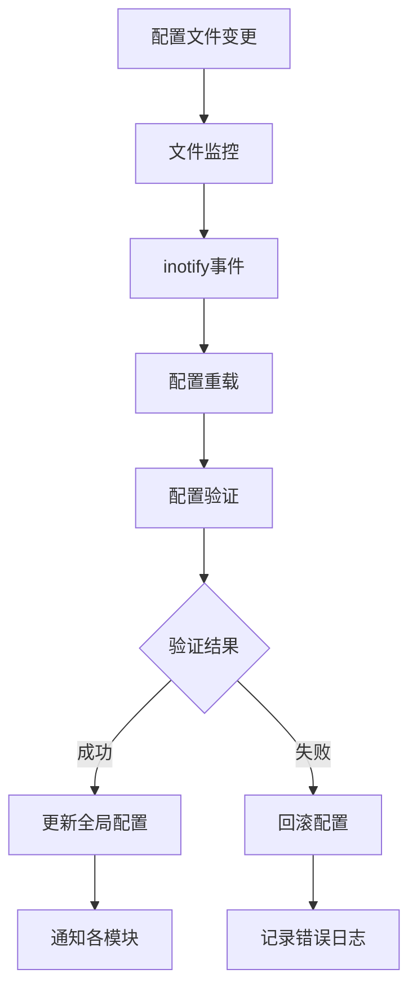

# LINX Config - 配置管理模块

## 📋 模块概述

`linx_config` 是系统的配置管理模块，负责解析和管理 `linx_apd.yaml` 配置文件，提供全局配置访问接口，并支持配置热更新功能。它是系统配置的统一入口，确保各模块能够获取到正确的配置参数。

## 🎯 核心功能

- **配置解析**: 解析YAML格式的主配置文件
- **全局配置**: 提供系统级别的配置参数管理
- **热更新**: 支持配置文件的动态重载
- **配置验证**: 配置参数的有效性验证
- **多文件支持**: 支持多个配置文件的层级覆盖

## 🔧 核心接口

### 主要API

```c
// 配置模块生命周期
int linx_config_init(void);
void linx_config_deinit(void);

// 配置加载和重载
int linx_config_load(const char *config_file);
int linx_config_reload(void);

// 配置访问
linx_global_config_t *linx_config_get(void);
```

### 全局配置结构

```c
typedef struct {
    struct {
        char *output;               // 日志输出路径
        char *log_level;            // 日志级别
    } log_config;

    struct {
        char *kind;                 // 引擎类型 (ebpf/kmod/plugin)
        
        union {
            struct {
                char *path;         // 内核模块路径
            } kmod;
            
            struct {
                bool drop_mode;     // 丢弃模式
                bool drop_failed;   // 丢弃失败事件
                uint32_t filter_pids[LINX_BPF_FILTER_PID_MAX_SIZE];
                uint8_t filter_comms[LINX_BPF_FILTER_COMM_MAX_SIZE][LINX_COMM_MAX_SIZE];
                uint8_t interest_syscall_table[LINX_SYSCALL_MAX_IDX];
            } ebpf;
        } data;
    } engine;
} linx_global_config_t;
```

## 🏗️ 配置文件结构

### 主配置文件示例

```yaml
# 配置文件目录，该目录下的配置会覆盖该文件内的配置
config_files:
  - /etc/linx_apd/config.d

# 监听配置文件是否变更，改变了就改变全局配置
watch_config_files: true

# 规则文件路径，可以是目录也可以是文件
rules_files:
  - /etc/linx_apd/linx_apd_rules.yaml
  - /etc/linx_apd/linx_apd_rules.local.yaml
  - /etc/linx_apd/rules.d

# 日志配置
log:
  output: stderr                # 输出位置: stderr, stdout, 或文件路径
  level: ERROR                  # 日志级别: DEBUG, INFO, WARNING, ERROR, FATAL

# 数据采集引擎配置
engine:
  kind: ebpf                    # 引擎类型: ebpf, kmod, plugin
  kmod:
    log_path: /tmp/ebpf.log
  ebpf:
    drop_mode: false            # 是否启用丢弃模式
    drop_failed: true           # 是否丢弃失败事件
    filter_pids: []             # 需要过滤的PID列表
    filter_comms: []            # 需要过滤的命令列表
    interest_syscall_file: /root/project/linx_apd/json_config/interesting_syscalls.json

# 要加载的插件
load_plugins: [json, k8s]

# 插件配置
plugin:
  - name: json
    library_path: libplugin_json.so
    init_config: ""
  - name: k8s
    library_path: libplugin_k8s.so
    init_config: ""

# 时间格式配置
time_format_iso_8601: false

# 数据格式配置
buffer_format_base64: false

# 规则优先级设置
minimum_rule_priority: INFO

# 告警输出配置
alert:
  thread_pool_size: 4
  outputs:
    stdout:
      enabled: true
      use_color: true
    file:
      enabled: true
      file_path: /var/log/linx_apd/alerts.log
    http:
      enabled: false
      url: https://webhook.example.com/alerts
    syslog:
      enabled: true
      facility: LOG_SECURITY

# 事件队列配置
event_queue:
  capacity: 10000
  batch_size: 100

# 线程配置
threads:
  engine_threads: 2
  rule_threads: 4
  alert_threads: 4
```

## ⚙️ 配置分类

### 系统级配置
- **日志配置**: 日志输出路径、级别、格式
- **线程配置**: 各模块的线程数量
- **内存配置**: 缓存大小、队列容量
- **文件配置**: 配置文件路径、规则文件路径

### 引擎配置
- **eBPF配置**: eBPF程序参数、过滤规则
- **内核模块配置**: 内核模块路径和参数
- **插件配置**: 插件库路径和初始化参数

### 业务配置
- **规则配置**: 规则文件路径、优先级设置
- **告警配置**: 输出渠道、格式设置
- **监控配置**: 性能监控、统计参数

## 🔄 配置热更新

### 热更新机制



### 支持热更新的配置项
- ✅ 日志级别和输出路径
- ✅ 告警输出配置
- ✅ 过滤规则（PID、命令）
- ✅ 线程池大小
- ❌ 引擎类型（需要重启）
- ❌ 插件配置（需要重启）

### 热更新API

```c
// 监听配置文件变更
int linx_config_watch_files(bool enable);

// 手动重载配置
int linx_config_reload(void);

// 注册配置变更回调
typedef void (*config_change_callback_t)(const char *key, void *old_value, void *new_value);
int linx_config_register_callback(const char *key, config_change_callback_t callback);
```

## 📝 配置验证

### 验证规则

```c
typedef struct {
    char *key;                  // 配置键名
    linx_config_type_t type;    // 配置类型
    bool required;              // 是否必需
    void *default_value;        // 默认值
    int (*validator)(void *value); // 验证函数
} config_rule_t;
```

### 验证示例

```c
// 日志级别验证
int validate_log_level(void *value) {
    char *level = (char *)value;
    if (strcmp(level, "DEBUG") == 0 ||
        strcmp(level, "INFO") == 0 ||
        strcmp(level, "WARNING") == 0 ||
        strcmp(level, "ERROR") == 0 ||
        strcmp(level, "FATAL") == 0) {
        return 0;
    }
    return -1;
}

// 端口号验证
int validate_port(void *value) {
    int port = *(int *)value;
    return (port > 0 && port < 65536) ? 0 : -1;
}
```

## 🔍 配置查询接口

### 通用查询接口

```c
// 按路径查询配置值
void *linx_config_get_value(const char *path);

// 查询字符串配置
const char *linx_config_get_string(const char *path, const char *default_value);

// 查询整数配置
int linx_config_get_int(const char *path, int default_value);

// 查询布尔配置
bool linx_config_get_bool(const char *path, bool default_value);

// 查询数组配置
int linx_config_get_array(const char *path, void **array, size_t *count);
```

### 查询示例

```c
// 查询日志级别
const char *log_level = linx_config_get_string("log.level", "ERROR");

// 查询线程数量
int thread_count = linx_config_get_int("alert.thread_pool_size", 4);

// 查询是否启用颜色输出
bool use_color = linx_config_get_bool("alert.stdout.use_color", true);

// 查询过滤PID列表
uint32_t *filter_pids;
size_t count;
linx_config_get_array("engine.ebpf.filter_pids", (void **)&filter_pids, &count);
```

## 🗂️ 配置文件层级

### 配置优先级（从高到低）

1. **命令行参数**: 最高优先级
2. **环境变量**: `LINX_APD_*` 前缀的环境变量
3. **用户配置**: `~/.linx_apd/config.yaml`
4. **本地配置**: `./linx_apd.yaml`
5. **系统配置**: `/etc/linx_apd/linx_apd.yaml`
6. **默认配置**: 内置默认值

### 配置文件合并

```c
// 配置合并策略
typedef enum {
    MERGE_REPLACE,              // 替换策略
    MERGE_APPEND,               // 追加策略
    MERGE_OVERRIDE,             // 覆盖策略
} config_merge_strategy_t;
```

## 🔒 配置安全

### 敏感信息处理
- **密码加密**: 敏感密码使用加密存储
- **权限控制**: 配置文件的读写权限控制
- **审计日志**: 配置变更的审计记录

### 配置文件权限

```bash
# 推荐的配置文件权限设置
chmod 640 /etc/linx_apd/linx_apd.yaml
chown root:linx_apd /etc/linx_apd/linx_apd.yaml
```

## 🚨 错误处理

### 错误类型

```c
typedef enum {
    CONFIG_ERROR_FILE_NOT_FOUND,    // 配置文件不存在
    CONFIG_ERROR_PARSE_FAILED,      // 解析失败
    CONFIG_ERROR_VALIDATION_FAILED, // 验证失败
    CONFIG_ERROR_PERMISSION_DENIED, // 权限拒绝
    CONFIG_ERROR_MEMORY_ALLOCATION, // 内存分配失败
} config_error_t;
```

### 错误处理策略

1. **解析错误**: 使用默认配置继续运行
2. **验证错误**: 回滚到上一个有效配置
3. **文件错误**: 尝试备用配置文件
4. **权限错误**: 降级到只读模式

## 📊 配置统计

### 监控指标

```c
typedef struct {
    int load_count;             // 加载次数
    int reload_count;           // 重载次数
    int error_count;            // 错误次数
    time_t last_load_time;      // 最后加载时间
    time_t last_reload_time;    // 最后重载时间
} config_stats_t;
```

### 统计接口

```c
// 获取配置统计信息
config_stats_t *linx_config_get_stats(void);

// 重置统计信息
void linx_config_reset_stats(void);
```

## 🔗 模块依赖

### 外部依赖
- **libyaml**: YAML文件解析
- **inotify**: 文件变更监控

### 内部依赖
- `linx_log` - 日志输出
- `linx_yaml` - YAML解析器

## 📝 使用示例

### 基本使用

```c
#include "linx_config.h"

// 初始化配置模块
int ret = linx_config_init();
if (ret != 0) {
    fprintf(stderr, "Failed to init config module\n");
    return -1;
}

// 加载配置文件
ret = linx_config_load("/etc/linx_apd/linx_apd.yaml");
if (ret != 0) {
    fprintf(stderr, "Failed to load config file\n");
    return -1;
}

// 获取全局配置
linx_global_config_t *config = linx_config_get();
printf("Engine type: %s\n", config->engine.kind);
printf("Log level: %s\n", config->log_config.log_level);

// 启用配置热更新
linx_config_watch_files(true);

// 清理资源
linx_config_deinit();
```

### 配置变更回调

```c
// 配置变更回调函数
void on_log_level_change(const char *key, void *old_value, void *new_value) {
    char *old_level = (char *)old_value;
    char *new_level = (char *)new_value;
    printf("Log level changed from %s to %s\n", old_level, new_level);
    
    // 更新日志模块配置
    linx_log_set_level(new_level);
}

// 注册配置变更回调
linx_config_register_callback("log.level", on_log_level_change);
```

## 🚀 扩展开发

### 添加新配置项

1. **更新配置结构**: 在`linx_global_config_t`中添加新字段
2. **添加验证规则**: 实现配置验证函数
3. **更新解析逻辑**: 在解析函数中处理新配置
4. **添加默认值**: 设置合理的默认值

### 自定义配置类型

```c
// 定义自定义配置类型
typedef struct {
    char *name;
    int port;
    bool enabled;
} custom_config_t;

// 实现配置解析函数
int parse_custom_config(yaml_node_t *node, custom_config_t *config) {
    // 解析逻辑
    return 0;
}

// 注册自定义配置类型
linx_config_register_type("custom", sizeof(custom_config_t), parse_custom_config);
```