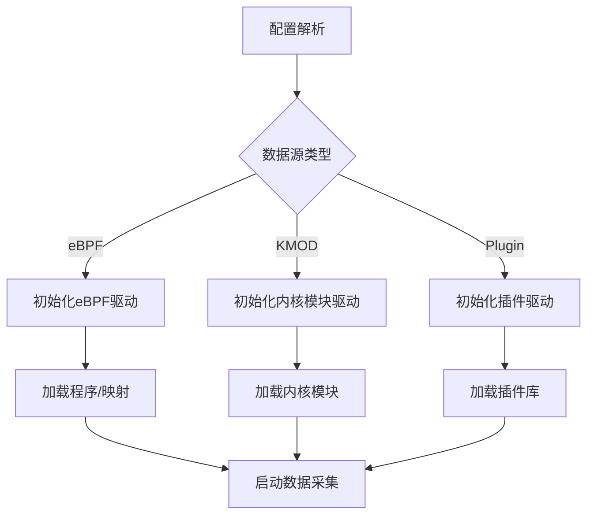
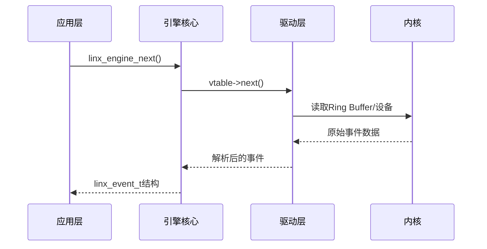

# LINX Engine - 数据采集引擎模块

## 📋 模块概述

`linx_engine` 是系统的数据采集引擎，提供抽象的数据源接口，支持多种驱动（eBPF、内核模块、插件等）。它负责管理所有事件源的加载/卸载，以及从不同事件源读取消息，为上层提供统一的事件获取接口。

## 🎯 核心功能

- **多驱动支持**: 支持eBPF、内核模块、插件等多种数据源
- **统一接口**: 为不同数据源提供统一的操作接口
- **动态加载**: 支持运行时动态加载和卸载数据源
- **事件获取**: 提供高效的事件获取机制
- **配置驱动**: 基于配置文件选择和配置数据源

## 🏗️ 模块结构

```
linx_engine/
├── include/
│   ├── linx_engine.h           # 主要接口定义
│   └── linx_engine_vtable.h    # 虚函数表定义
├── ebpf/                       # eBPF驱动实现
│   ├── include/
│   │   ├── linx_engine_ebpf.h
│   │   ├── linx_ebpf_api.h
│   │   └── linx_ebpf_common.h
│   ├── linx_engine_ebpf.c      # eBPF引擎实现
│   ├── linx_ebpf_load.c        # eBPF程序加载
│   ├── linx_ebpf_maps.c        # eBPF映射管理
│   └── linx_ebpf_ringbuf.c     # Ring Buffer处理
├── kmod/                       # 内核模块驱动
│   └── include/
├── plugin/                     # 插件驱动框架
│   └── include/
├── linx_engine.c               # 引擎核心实现
└── Makefile                    # 构建配置
```

## 🔧 核心接口

### 主要API

```c
// 引擎管理接口
int linx_engine_init(linx_global_config_t *config);
int linx_engine_close(void);
int linx_engine_start(void);
int linx_engine_stop(void);

// 事件获取接口
int linx_engine_next(linx_event_t **event);
```

### 虚函数表接口

```c
typedef struct {
    int (*init)(void *config);           // 初始化数据源
    int (*destroy)(void);                // 销毁数据源
    int (*start)(void);                  // 启动数据采集
    int (*stop)(void);                   // 停止数据采集
    int (*next)(linx_event_t **event);   // 获取下一个事件
    int (*get_msg)(void);                // 获取消息
} linx_engine_vtable_t;
```

### 引擎结构

```c
typedef struct {
    linx_engine_vtable_t *vtable;        // 虚函数表指针
} linx_engine_t;
```

## 🚀 eBPF驱动子模块

### 功能特性
- **程序加载**: 动态加载eBPF程序到内核
- **映射管理**: 管理eBPF映射的创建和访问
- **Ring Buffer**: 高效的内核-用户态数据传输
- **事件过滤**: 基于配置的事件过滤机制

### 核心文件

#### linx_engine_ebpf.c
- eBPF引擎的主要实现
- 实现虚函数表的所有接口
- 管理eBPF程序的生命周期

#### linx_ebpf_load.c
- 负责eBPF程序的加载和附加
- 处理eBPF程序的验证和链接
- 管理eBPF程序的卸载

#### linx_ebpf_maps.c
- 管理eBPF映射的创建和配置
- 提供映射的读写接口
- 处理映射的生命周期管理

#### linx_ebpf_ringbuf.c
- 实现Ring Buffer的读取逻辑
- 提供高效的数据传输机制
- 处理数据的解析和转换

### eBPF配置

```c
struct {
    bool drop_mode;                      // 丢弃模式
    bool drop_failed;                    // 丢弃失败事件
    uint32_t filter_pids[MAX_SIZE];      // PID过滤列表
    uint8_t filter_comms[MAX_SIZE][32];  // 命令过滤列表
    uint8_t interest_syscall_table[MAX]; // 感兴趣的系统调用表
} ebpf_config;
```

## 🔌 插件驱动框架

### 插件接口
- 动态库加载机制
- 标准化的插件API
- 插件配置和管理
- 插件生命周期控制

### 支持的插件类型
- **JSON插件**: 处理JSON格式的事件数据
- **K8s插件**: 集成Kubernetes事件
- **自定义插件**: 用户自定义的数据源插件

## 🛠️ 数据源管理

### 数据源选择

引擎根据配置文件自动选择数据源：

```yaml
engine:
  kind: ebpf                    # 数据源类型：ebpf/kmod/plugin
  ebpf:
    drop_mode: false
    drop_failed: true
    filter_pids: []
    filter_comms: []
    interest_syscall_file: "/path/to/syscalls.json"
```

### 初始化流程



## 📊 事件处理流程

### 事件获取流程



### 数据转换

1. **内核原始数据** → **Ring Buffer**
2. **Ring Buffer** → **驱动层解析**
3. **驱动层解析** → **标准事件结构**
4. **标准事件结构** → **应用层处理**

## ⚡ 性能特性

### 高性能设计
- **零拷贝传输**: eBPF Ring Buffer实现零拷贝
- **批量处理**: 支持批量事件获取
- **内存池**: 事件对象的内存池管理
- **异步处理**: 非阻塞的事件获取机制

### 性能优化
- **事件过滤**: 内核态事件过滤减少数据传输
- **选择性采集**: 只采集感兴趣的系统调用
- **动态配置**: 运行时调整采集参数

## 🔍 监控和调试

### 统计信息
- 采集事件总数
- 丢弃事件数量
- 数据传输速率
- 内存使用情况

### 调试支持
- 详细的错误日志
- 事件数据转储
- 性能指标输出
- 调试模式开关

## ⚙️ 配置选项

### eBPF驱动配置

```yaml
ebpf:
  drop_mode: false              # 是否丢弃模式
  drop_failed: true             # 是否丢弃失败事件
  filter_pids: [1000, 1001]     # 过滤的PID列表
  filter_comms: ["bash", "vim"] # 过滤的命令列表
  interest_syscall_file: "/etc/linx_apd/syscalls.json"
```

### 内核模块配置

```yaml
kmod:
  log_path: "/var/log/linx_kmod.log"  # 内核模块日志路径
```

### 插件配置

```yaml
load_plugins: [json, k8s]       # 要加载的插件列表
plugin:
  - name: json
    library_path: "libplugin_json.so"
    init_config: ""
  - name: k8s
    library_path: "libplugin_k8s.so"
    init_config: "cluster_config"
```

## 🚨 错误处理

### 错误类型
- **加载错误**: eBPF程序或插件加载失败
- **运行时错误**: 数据采集过程中的错误
- **配置错误**: 配置参数无效或冲突

### 错误恢复
- 自动重试机制
- 降级处理策略
- 错误状态报告
- 优雅失败处理

## 🔗 模块依赖

### 外部依赖
- **libbpf**: eBPF程序加载和管理
- **libelf**: ELF文件处理
- **zlib**: 数据压缩支持

### 内部依赖
- `linx_config` - 配置管理
- `linx_event` - 事件结构定义
- `linx_log` - 日志输出

## 🚀 扩展开发

### 添加新驱动

1. 实现虚函数表接口
2. 注册驱动到引擎
3. 添加配置支持
4. 编写测试用例

### 插件开发

1. 实现插件API接口
2. 编译为动态库
3. 配置插件参数
4. 部署和加载

## 📝 使用示例

### 基本使用

```c
#include "linx_engine.h"

// 初始化引擎
linx_global_config_t *config = linx_config_get();
int ret = linx_engine_init(config);

// 启动数据采集
ret = linx_engine_start();

// 获取事件
linx_event_t *event;
while (1) {
    ret = linx_engine_next(&event);
    if (ret > 0) {
        // 处理事件
        process_event(event);
    }
}

// 停止和清理
linx_engine_stop();
linx_engine_close();
```