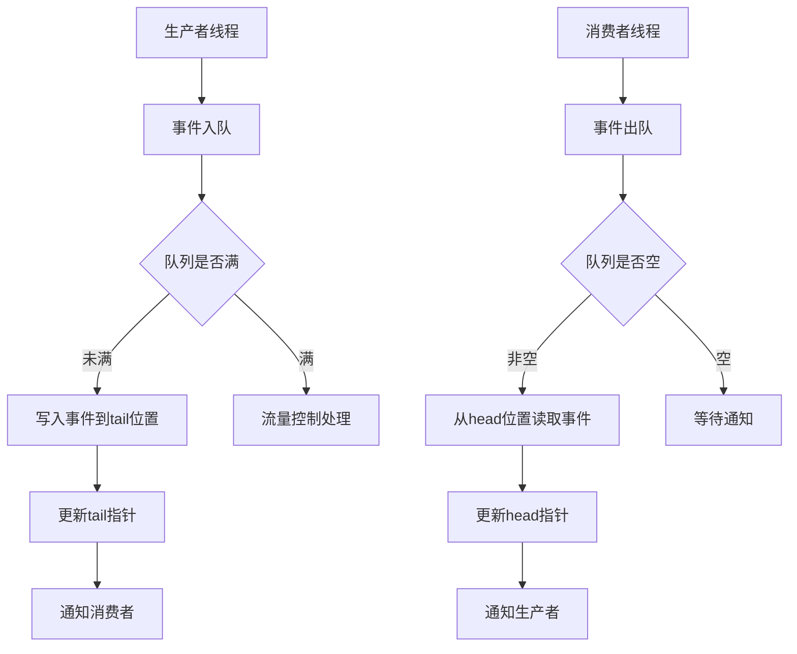

# LINX Event Queue - 事件队列模块

## 📋 模块概述

`linx_event_queue` 是系统的事件队列管理模块，负责管理从内核态上传的事件消息，提供高效的事件缓存、流量控制和多线程安全的队列操作。它是事件处理流水线的关键组件，确保事件数据的可靠传输和处理。

## 🎯 核心功能

- **环形队列**: 高效的环形缓冲区实现
- **零拷贝传输**: 内核-用户态的零拷贝数据传输
- **流量控制**: 防止队列溢出的流量控制机制
- **多线程安全**: 支持多生产者多消费者模式
- **批量处理**: 批量事件入队和出队操作

## 🔧 核心接口

### 主要API

```c
// 队列生命周期管理
int linx_event_queue_init(uint64_t capacity);
void linx_event_queue_free(void);

// 事件队列操作
int linx_event_queue_push(void);
int linx_event_queue_pop(linx_event_t **event);
int linx_event_queue_batch_push(linx_event_t **events, int count);
int linx_event_queue_batch_pop(linx_event_t **events, int max_count);

// 队列状态查询
int linx_event_queue_size(void);
int linx_event_queue_capacity(void);
bool linx_event_queue_is_full(void);
bool linx_event_queue_is_empty(void);
```

### 队列结构定义

```c
typedef struct {
    int capacity;               // 队列容量
    int head;                   // 队列头部索引
    int tail;                   // 队列尾部索引
    int count;                  // 当前元素数量
    linx_event_t **events;      // 事件指针数组
    pthread_mutex_t mutex;      // 互斥锁
    pthread_cond_t not_full;    // 非满条件变量
    pthread_cond_t not_empty;   // 非空条件变量
    uint64_t total_push;        // 总入队数量
    uint64_t total_pop;         // 总出队数量
    uint64_t total_drops;       // 总丢弃数量
} linx_event_queue_t;
```

## 🏗️ 队列架构

### 环形缓冲区设计



### 内存布局

```
Ring Buffer Layout:
┌─────┬─────┬─────┬─────┬─────┬─────┬─────┬─────┐
│  0  │  1  │  2  │  3  │  4  │  5  │  6  │  7  │
└─────┴─────┴─────┴─────┴─────┴─────┴─────┴─────┘
  ↑                               ↑
 head                           tail
(消费位置)                     (生产位置)
```

## ⚡ 性能优化

### 零拷贝实现

```c
// 零拷贝事件推送
int linx_event_queue_push_zerocopy(linx_event_t *event) {
    pthread_mutex_lock(&queue->mutex);
    
    // 直接移交事件指针，避免数据拷贝
    if (queue->count < queue->capacity) {
        queue->events[queue->tail] = event;
        queue->tail = (queue->tail + 1) % queue->capacity;
        queue->count++;
        queue->total_push++;
        
        pthread_cond_signal(&queue->not_empty);
        pthread_mutex_unlock(&queue->mutex);
        return 0;
    } else {
        // 队列已满处理
        handle_queue_full(event);
        pthread_mutex_unlock(&queue->mutex);
        return -1;
    }
}
```

### 批量处理优化

```c
// 批量出队操作
int linx_event_queue_batch_pop(linx_event_t **events, int max_count) {
    pthread_mutex_lock(&queue->mutex);
    
    int actual_count = 0;
    while (actual_count < max_count && queue->count > 0) {
        events[actual_count] = queue->events[queue->head];
        queue->head = (queue->head + 1) % queue->capacity;
        queue->count--;
        actual_count++;
    }
    
    queue->total_pop += actual_count;
    if (actual_count > 0) {
        pthread_cond_signal(&queue->not_full);
    }
    
    pthread_mutex_unlock(&queue->mutex);
    return actual_count;
}
```

## 🚦 流量控制机制

### 背压控制

```c
typedef enum {
    FLOW_CONTROL_BLOCK,         // 阻塞等待
    FLOW_CONTROL_DROP,          // 丢弃新事件
    FLOW_CONTROL_OVERWRITE,     // 覆盖旧事件
    FLOW_CONTROL_EXPAND,        // 动态扩容
} flow_control_strategy_t;
```

### 流量控制配置

```yaml
event_queue:
  capacity: 10000
  flow_control:
    strategy: "drop"            # block, drop, overwrite, expand
    high_watermark: 0.8         # 高水位线
    low_watermark: 0.2          # 低水位线
    drop_policy: "oldest"       # oldest, newest, priority
```

### 动态扩容

```c
// 动态扩容实现
int linx_event_queue_expand(int new_capacity) {
    pthread_mutex_lock(&queue->mutex);
    
    if (new_capacity <= queue->capacity) {
        pthread_mutex_unlock(&queue->mutex);
        return -1;
    }
    
    // 分配新的事件数组
    linx_event_t **new_events = malloc(new_capacity * sizeof(linx_event_t *));
    if (!new_events) {
        pthread_mutex_unlock(&queue->mutex);
        return -1;
    }
    
    // 拷贝现有事件到新数组
    int i, j = 0;
    for (i = queue->head; i != queue->tail; i = (i + 1) % queue->capacity) {
        new_events[j++] = queue->events[i];
    }
    
    // 更新队列参数
    free(queue->events);
    queue->events = new_events;
    queue->head = 0;
    queue->tail = queue->count;
    queue->capacity = new_capacity;
    
    pthread_mutex_unlock(&queue->mutex);
    return 0;
}
```

## 📊 统计和监控

### 性能指标

```c
typedef struct {
    uint64_t total_push;        // 总入队数量
    uint64_t total_pop;         // 总出队数量
    uint64_t total_drops;       // 总丢弃数量
    uint64_t current_size;      // 当前队列大小
    uint64_t max_size_reached;  // 历史最大队列大小
    double avg_latency;         // 平均延迟
    double throughput;          // 吞吐量
    time_t last_reset_time;     // 最后重置时间
} queue_stats_t;
```

### 监控接口

```c
// 获取队列统计信息
queue_stats_t *linx_event_queue_get_stats(void);

// 重置统计信息
void linx_event_queue_reset_stats(void);

// 获取实时队列状态
typedef struct {
    int current_size;
    int capacity;
    double utilization;         // 利用率
    bool is_full;
    bool is_empty;
} queue_status_t;

queue_status_t *linx_event_queue_get_status(void);
```

### 性能报告

```bash
Event Queue Statistics:
  Capacity: 10,000
  Current Size: 1,234 (12.34%)
  Total Pushed: 1,256,789
  Total Popped: 1,255,555
  Total Dropped: 0
  Max Size Reached: 8,765
  Average Latency: 1.2ms
  Throughput: 15,432 events/sec
  Uptime: 2h 35m 12s
```

## 🔧 配置选项

### 基本配置

```yaml
event_queue:
  # 队列容量配置
  capacity: 10000             # 最大事件数量
  initial_capacity: 1000      # 初始容量
  
  # 线程安全配置
  enable_locking: true        # 启用线程安全
  lock_timeout: 1000         # 锁超时时间(ms)
  
  # 性能优化配置
  batch_size: 100            # 批量处理大小
  prefetch_size: 50          # 预取大小
  
  # 内存管理
  use_memory_pool: true      # 使用内存池
  pool_size: 1000           # 内存池大小
```

### 高级配置

```yaml
event_queue:
  # 优先级队列
  enable_priority: false     # 启用优先级队列
  priority_levels: 5         # 优先级级别数
  
  # 持久化配置
  enable_persistence: false  # 启用持久化
  persistence_file: "/tmp/queue.dat"
  sync_interval: 1000       # 同步间隔(ms)
  
  # 监控配置
  enable_metrics: true      # 启用指标收集
  metrics_interval: 5       # 指标收集间隔(s)
```

## 🔒 线程安全

### 锁机制

```c
// 读写锁实现
typedef struct {
    pthread_rwlock_t rwlock;   // 读写锁
    int readers;               // 读者数量
    int writers;               // 写者数量
} linx_queue_lock_t;

// 无锁队列实现（适用于单生产者单消费者）
typedef struct {
    volatile int head;
    volatile int tail;
    linx_event_t *events[QUEUE_SIZE];
} lockfree_queue_t;
```

### 内存序问题

```c
// 使用内存屏障确保正确性
void linx_event_queue_push_lockfree(linx_event_t *event) {
    int current_tail = queue->tail;
    int next_tail = (current_tail + 1) % QUEUE_SIZE;
    
    // 检查队列是否已满
    if (next_tail == queue->head) {
        return; // 队列已满
    }
    
    // 写入事件
    queue->events[current_tail] = event;
    
    // 内存屏障确保写入完成后再更新tail
    __sync_synchronize();
    queue->tail = next_tail;
}
```

## 🚨 错误处理

### 错误类型

```c
typedef enum {
    QUEUE_ERROR_NONE = 0,
    QUEUE_ERROR_FULL,           // 队列已满
    QUEUE_ERROR_EMPTY,          // 队列为空
    QUEUE_ERROR_INVALID_PARAM,  // 无效参数
    QUEUE_ERROR_MEMORY,         // 内存错误
    QUEUE_ERROR_TIMEOUT,        // 超时错误
} queue_error_t;
```

### 错误恢复策略

```c
// 错误恢复函数
int linx_event_queue_recover(queue_error_t error) {
    switch (error) {
        case QUEUE_ERROR_FULL:
            // 尝试扩容或清理旧事件
            return handle_queue_overflow();
            
        case QUEUE_ERROR_MEMORY:
            // 内存压缩和垃圾回收
            return handle_memory_pressure();
            
        case QUEUE_ERROR_TIMEOUT:
            // 检查死锁并恢复
            return handle_timeout_recovery();
            
        default:
            return -1;
    }
}
```

## 🔗 模块依赖

### 外部依赖
- **pthread**: 线程同步原语
- **libc**: 标准C库函数

### 内部依赖
- `linx_event` - 事件结构定义
- `linx_log` - 日志输出
- `linx_thread` - 线程管理

## 📝 使用示例

### 基本使用

```c
#include "linx_event_queue.h"

// 初始化事件队列
int ret = linx_event_queue_init(10000);
if (ret != 0) {
    fprintf(stderr, "Failed to init event queue\n");
    return -1;
}

// 生产者：推送事件
linx_event_t *event = create_event();
ret = linx_event_queue_push();
if (ret != 0) {
    // 处理队列满或其他错误
    handle_push_error(ret);
}

// 消费者：弹出事件
linx_event_t *event;
ret = linx_event_queue_pop(&event);
if (ret > 0) {
    // 处理事件
    process_event(event);
    free_event(event);
}

// 清理资源
linx_event_queue_free();
```

### 批量处理示例

```c
// 批量入队
linx_event_t *events[100];
int event_count = collect_events(events, 100);
int pushed = linx_event_queue_batch_push(events, event_count);

// 批量出队
linx_event_t *events[50];
int popped = linx_event_queue_batch_pop(events, 50);
for (int i = 0; i < popped; i++) {
    process_event(events[i]);
    free_event(events[i]);
}
```

## 🚀 扩展开发

### 优先级队列实现

```c
// 优先级队列结构
typedef struct {
    linx_event_queue_t queues[MAX_PRIORITY_LEVELS];
    int priority_levels;
} priority_queue_t;

// 按优先级入队
int linx_priority_queue_push(linx_event_t *event, int priority) {
    if (priority < 0 || priority >= MAX_PRIORITY_LEVELS) {
        return -1;
    }
    return linx_event_queue_push_to(&queues[priority], event);
}

// 按优先级出队
int linx_priority_queue_pop(linx_event_t **event) {
    // 从最高优先级开始查找
    for (int i = MAX_PRIORITY_LEVELS - 1; i >= 0; i--) {
        if (!linx_event_queue_is_empty(&queues[i])) {
            return linx_event_queue_pop(&queues[i], event);
        }
    }
    return 0; // 所有队列都为空
}
```

### 持久化队列

```c
// 持久化队列实现
typedef struct {
    linx_event_queue_t *memory_queue;
    int persistence_fd;
    char *persistence_file;
    bool sync_on_write;
} persistent_queue_t;

// 持久化写入
int linx_persistent_queue_push(linx_event_t *event) {
    // 先写入内存队列
    int ret = linx_event_queue_push(memory_queue, event);
    if (ret == 0 && sync_on_write) {
        // 同步写入持久化存储
        ret = write_event_to_disk(event);
    }
    return ret;
}
```