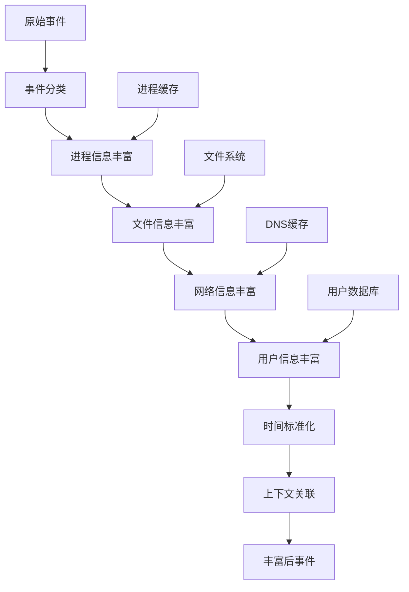
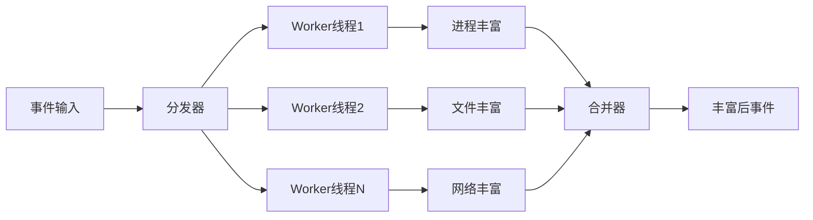

# LINX Event Rich - 事件上下文丰富模块

## 📋 模块概述

`linx_event_rich` 是系统的事件上下文丰富模块，负责为从内核采集的原始事件添加丰富的上下文信息。它通过进程树构建、文件信息获取、网络连接解析等方式，将简单的系统调用事件转换为包含完整上下文的安全事件。

## 🎯 核心功能

- **进程上下文丰富**: 获取进程的详细信息和进程树关系
- **文件信息增强**: 添加文件哈希、权限、所有者等信息
- **网络连接解析**: DNS反向解析、连接状态分析
- **用户信息获取**: 用户名、组信息、权限等
- **时间戳标准化**: 统一时间格式和时区处理

## 🔧 核心接口

### 主要API

```c
// 模块生命周期
int linx_event_rich_init(void);
void linx_event_rich_deinit(void);

// 事件丰富处理
int linx_event_rich(linx_event_t *event);
int linx_event_rich_batch(linx_event_t **events, int count);

// 特定信息丰富
int linx_event_rich_process_info(linx_event_t *event);
int linx_event_rich_file_info(linx_event_t *event);
int linx_event_rich_network_info(linx_event_t *event);
int linx_event_rich_user_info(linx_event_t *event);
```

### 丰富后的事件结构

原始的`linx_event_t`结构会被扩展更多字段：

```c
typedef struct {
    // 原始字段
    uint64_t    tid;
    uint64_t    pid;
    uint64_t    ppid;
    // ... 其他原始字段

    // 丰富的进程信息
    struct {
        char        name[256];          // 进程名
        char        cmdline[1024];      // 完整命令行
        char        exe_path[512];      // 可执行文件路径
        char        cwd[512];           // 当前工作目录
        uint64_t    start_time;         // 进程启动时间
        uint32_t    session_id;         // 会话ID
        char        tty[32];            // 终端设备
    } proc_info;

    // 父进程信息
    struct {
        char        name[256];
        char        cmdline[1024];
        char        exe_path[512];
    } parent_info;

    // 用户信息
    struct {
        char        username[128];      // 用户名
        char        groupname[128];     // 组名
        uint32_t    real_uid;          // 真实用户ID
        uint32_t    real_gid;          // 真实组ID
        uint32_t    effective_uid;     // 有效用户ID
        uint32_t    effective_gid;     // 有效组ID
    } user_info;

    // 文件信息
    struct {
        char        file_type[32];      // 文件类型
        uint64_t    file_size;          // 文件大小
        uint32_t    file_mode;          // 文件权限
        char        file_hash[65];      // 文件SHA256哈希
        char        mime_type[128];     // MIME类型
        uint64_t    inode;              // inode号
    } file_info;

    // 网络信息
    struct {
        char        local_ip[64];       // 本地IP
        uint16_t    local_port;         // 本地端口
        char        remote_ip[64];      // 远程IP
        uint16_t    remote_port;        // 远程端口
        char        remote_hostname[256]; // 远程主机名
        char        protocol[16];       // 协议类型
        char        connection_state[32]; // 连接状态
    } network_info;

    // 系统信息
    struct {
        char        hostname[256];      // 主机名
        char        kernel_version[128]; // 内核版本
        uint64_t    boot_time;          // 系统启动时间
        uint64_t    enriched_time;      // 丰富处理时间
    } system_info;
} linx_enriched_event_t;
```

## 🏗️ 模块架构

### 信息丰富流水线



### 并发处理架构



## 🔍 信息丰富子模块

### 进程信息丰富 (Process Enrichment)

#### 功能特性
- **进程树构建**: 构建完整的进程父子关系
- **命令行解析**: 解析和标准化命令行参数
- **环境变量**: 获取关键环境变量信息
- **进程状态**: 获取进程运行状态信息

#### 实现示例

```c
int linx_event_rich_process_info(linx_event_t *event) {
    char proc_path[256];
    char buffer[4096];
    FILE *fp;
    
    // 读取进程命令行
    snprintf(proc_path, sizeof(proc_path), "/proc/%d/cmdline", event->pid);
    fp = fopen(proc_path, "r");
    if (fp) {
        if (fgets(buffer, sizeof(buffer), fp)) {
            // 处理NULL分隔的命令行参数
            normalize_cmdline(buffer, event->proc_info.cmdline);
        }
        fclose(fp);
    }
    
    // 读取可执行文件路径
    snprintf(proc_path, sizeof(proc_path), "/proc/%d/exe", event->pid);
    if (readlink(proc_path, event->proc_info.exe_path, 
                 sizeof(event->proc_info.exe_path) - 1) > 0) {
        // 获取文件基本信息
        get_file_basic_info(event->proc_info.exe_path, &event->file_info);
    }
    
    // 获取当前工作目录
    snprintf(proc_path, sizeof(proc_path), "/proc/%d/cwd", event->pid);
    readlink(proc_path, event->proc_info.cwd, sizeof(event->proc_info.cwd) - 1);
    
    return 0;
}
```

### 文件信息丰富 (File Enrichment)

#### 功能特性
- **文件哈希计算**: 计算SHA256、MD5等文件哈希
- **MIME类型检测**: 自动检测文件MIME类型
- **权限分析**: 分析文件权限和安全属性
- **文件系统信息**: 获取inode、设备等信息

#### 实现示例

```c
int linx_event_rich_file_info(linx_event_t *event) {
    struct stat file_stat;
    const char *file_path = event->fd_path[0]; // 第一个文件描述符
    
    if (!file_path || stat(file_path, &file_stat) != 0) {
        return -1;
    }
    
    // 基本文件信息
    event->file_info.file_size = file_stat.st_size;
    event->file_info.file_mode = file_stat.st_mode;
    event->file_info.inode = file_stat.st_ino;
    
    // 文件类型判断
    if (S_ISREG(file_stat.st_mode)) {
        strcpy(event->file_info.file_type, "regular");
        
        // 计算文件哈希（仅对小文件）
        if (file_stat.st_size < MAX_HASH_FILE_SIZE) {
            calculate_file_hash(file_path, event->file_info.file_hash);
        }
        
        // 检测MIME类型
        detect_mime_type(file_path, event->file_info.mime_type);
    } else if (S_ISDIR(file_stat.st_mode)) {
        strcpy(event->file_info.file_type, "directory");
    } else if (S_ISLNK(file_stat.st_mode)) {
        strcpy(event->file_info.file_type, "symlink");
    }
    
    return 0;
}
```

### 网络信息丰富 (Network Enrichment)

#### 功能特性
- **DNS反向解析**: 将IP地址解析为主机名
- **端口服务识别**: 识别常见端口对应的服务
- **连接状态获取**: 获取TCP连接状态
- **地理位置信息**: 获取IP地址的地理位置（可选）

#### 实现示例

```c
int linx_event_rich_network_info(linx_event_t *event) {
    // 从socket信息中提取网络地址
    if (event->syscall_id == SYS_connect || event->syscall_id == SYS_accept) {
        struct sockaddr_in *addr = (struct sockaddr_in *)event->params[1];
        
        // 提取IP和端口
        inet_ntop(AF_INET, &addr->sin_addr, 
                  event->network_info.remote_ip, 
                  sizeof(event->network_info.remote_ip));
        event->network_info.remote_port = ntohs(addr->sin_port);
        
        // DNS反向解析（异步）
        dns_reverse_lookup_async(event->network_info.remote_ip,
                                  event->network_info.remote_hostname,
                                  sizeof(event->network_info.remote_hostname));
        
        // 端口服务识别
        const char *service = get_port_service(event->network_info.remote_port);
        if (service) {
            snprintf(event->network_info.protocol, 
                     sizeof(event->network_info.protocol), "%s", service);
        }
    }
    
    return 0;
}
```

### 用户信息丰富 (User Enrichment)

#### 功能特性
- **用户名解析**: 将UID解析为用户名
- **组信息获取**: 获取用户所属的组信息
- **权限分析**: 分析用户权限和角色
- **会话信息**: 获取登录会话信息

#### 实现示例

```c
int linx_event_rich_user_info(linx_event_t *event) {
    struct passwd *pwd;
    struct group *grp;
    
    // 获取用户信息
    pwd = getpwuid(event->uid);
    if (pwd) {
        strncpy(event->user_info.username, pwd->pw_name, 
                sizeof(event->user_info.username) - 1);
    }
    
    // 获取组信息
    grp = getgrgid(event->gid);
    if (grp) {
        strncpy(event->user_info.groupname, grp->gr_name,
                sizeof(event->user_info.groupname) - 1);
    }
    
    // 获取有效用户ID（如果使用了setuid）
    get_effective_ids(event->pid, 
                      &event->user_info.effective_uid,
                      &event->user_info.effective_gid);
    
    return 0;
}
```

## ⚡ 性能优化

### 缓存机制

```c
// 进程信息缓存
typedef struct {
    uint32_t pid;
    time_t cache_time;
    linx_process_info_t info;
} process_cache_entry_t;

// DNS解析缓存
typedef struct {
    char ip[64];
    char hostname[256];
    time_t cache_time;
    time_t ttl;
} dns_cache_entry_t;

// 文件哈希缓存
typedef struct {
    char file_path[512];
    uint64_t file_size;
    time_t mtime;
    char hash[65];
} file_hash_cache_entry_t;
```

### 异步处理

```c
// 异步DNS解析
typedef struct {
    char ip[64];
    char *hostname_buffer;
    size_t buffer_size;
    dns_callback_t callback;
    void *user_data;
} dns_resolve_task_t;

// 异步文件哈希计算
typedef struct {
    char file_path[512];
    char *hash_buffer;
    hash_callback_t callback;
    void *user_data;
} hash_compute_task_t;
```

### 批量处理

```c
// 批量事件丰富
int linx_event_rich_batch(linx_event_t **events, int count) {
    // 按类型分组
    group_events_by_type(events, count);
    
    // 批量处理相同类型的事件
    process_file_events_batch();
    process_network_events_batch();
    process_process_events_batch();
    
    // 合并结果
    merge_enrichment_results(events, count);
    
    return 0;
}
```

## 🔧 配置选项

### 基本配置

```yaml
event_rich:
  # 启用的丰富模块
  enabled_modules:
    - process_info
    - file_info
    - network_info
    - user_info
  
  # 进程信息配置
  process:
    enable_cmdline: true
    enable_environ: false
    enable_process_tree: true
    max_cmdline_length: 1024
  
  # 文件信息配置
  file:
    enable_hash: true
    enable_mime_detection: true
    max_hash_file_size: "10MB"
    hash_algorithm: "sha256"
  
  # 网络信息配置
  network:
    enable_dns_lookup: true
    enable_geoip: false
    dns_timeout: 5
    dns_cache_ttl: 3600
  
  # 缓存配置
  cache:
    process_cache_size: 10000
    dns_cache_size: 5000
    file_hash_cache_size: 1000
    cache_cleanup_interval: 300
```

### 高级配置

```yaml
event_rich:
  # 性能配置
  performance:
    worker_threads: 4
    batch_size: 100
    async_processing: true
    
  # 资源限制
  limits:
    max_memory_usage: "500MB"
    max_file_size_for_hash: "50MB"
    max_dns_queries_per_second: 100
    
  # 安全配置
  security:
    allowed_file_types: ["regular", "directory"]
    blocked_paths: ["/proc", "/sys"]
    enable_privilege_check: true
```

## 📊 统计和监控

### 性能指标

```c
typedef struct {
    uint64_t total_events_processed;    // 总处理事件数
    uint64_t total_events_enriched;     // 总丰富事件数
    uint64_t cache_hits;                // 缓存命中数
    uint64_t cache_misses;              // 缓存未命中数
    uint64_t dns_queries;               // DNS查询数
    uint64_t file_hashes_computed;      // 文件哈希计算数
    double avg_processing_time;         // 平均处理时间
    double cache_hit_rate;              // 缓存命中率
} enrichment_stats_t;
```

### 监控接口

```c
// 获取统计信息
enrichment_stats_t *linx_event_rich_get_stats(void);

// 重置统计信息
void linx_event_rich_reset_stats(void);

// 获取缓存状态
typedef struct {
    int process_cache_usage;
    int dns_cache_usage;
    int file_cache_usage;
    double memory_usage_mb;
} cache_status_t;

cache_status_t *linx_event_rich_get_cache_status(void);
```

## 🚨 错误处理

### 错误类型

```c
typedef enum {
    ENRICH_ERROR_NONE = 0,
    ENRICH_ERROR_PROC_NOT_FOUND,       // 进程不存在
    ENRICH_ERROR_FILE_NOT_ACCESSIBLE,  // 文件无法访问
    ENRICH_ERROR_DNS_TIMEOUT,          // DNS解析超时
    ENRICH_ERROR_MEMORY_LIMIT,         // 内存限制
    ENRICH_ERROR_PERMISSION_DENIED,    // 权限拒绝
} enrichment_error_t;
```

### 降级策略

```c
// 降级处理配置
typedef struct {
    bool skip_on_error;                 // 错误时跳过丰富
    bool use_cached_data;               // 使用缓存数据
    int max_retry_count;                // 最大重试次数
    int fallback_timeout;               // 降级超时时间
} degradation_config_t;
```

## 🔗 模块依赖

### 外部依赖
- **libmagic**: 文件类型检测
- **libssl**: 哈希计算
- **libresolv**: DNS解析

### 内部依赖
- `linx_process_cache` - 进程缓存
- `linx_thread` - 线程管理
- `linx_log` - 日志输出
- `linx_config` - 配置管理

## 📝 使用示例

### 基本使用

```c
#include "linx_event_rich.h"

// 初始化丰富模块
int ret = linx_event_rich_init();
if (ret != 0) {
    fprintf(stderr, "Failed to init event rich module\n");
    return -1;
}

// 丰富单个事件
linx_event_t *event = get_raw_event();
ret = linx_event_rich(event);
if (ret == 0) {
    // 事件已成功丰富
    printf("Process: %s\n", event->proc_info.name);
    printf("File: %s\n", event->file_info.file_type);
    printf("User: %s\n", event->user_info.username);
}

// 批量丰富事件
linx_event_t *events[100];
int count = get_batch_events(events, 100);
ret = linx_event_rich_batch(events, count);

// 清理资源
linx_event_rich_deinit();
```

### 自定义丰富处理器

```c
// 自定义文件类型检测
int custom_file_type_detector(const char *file_path, char *file_type) {
    // 自定义逻辑
    if (has_magic_header(file_path, "\x7fELF")) {
        strcpy(file_type, "elf_executable");
        return 0;
    }
    return -1;
}

// 注册自定义处理器
linx_event_rich_register_file_detector(custom_file_type_detector);
```

## 🚀 扩展开发

### 添加新的丰富模块

```c
// 定义新的丰富模块
typedef struct {
    char name[64];
    int (*init)(void);
    int (*process)(linx_event_t *event);
    void (*cleanup)(void);
} enrichment_module_t;

// 实现容器信息丰富模块
int container_enrichment_init(void) {
    // 初始化容器信息获取
    return 0;
}

int container_enrichment_process(linx_event_t *event) {
    // 获取容器信息
    get_container_info(event->pid, &event->container_info);
    return 0;
}

// 注册新模块
enrichment_module_t container_module = {
    .name = "container_info",
    .init = container_enrichment_init,
    .process = container_enrichment_process,
    .cleanup = NULL
};

linx_event_rich_register_module(&container_module);
```