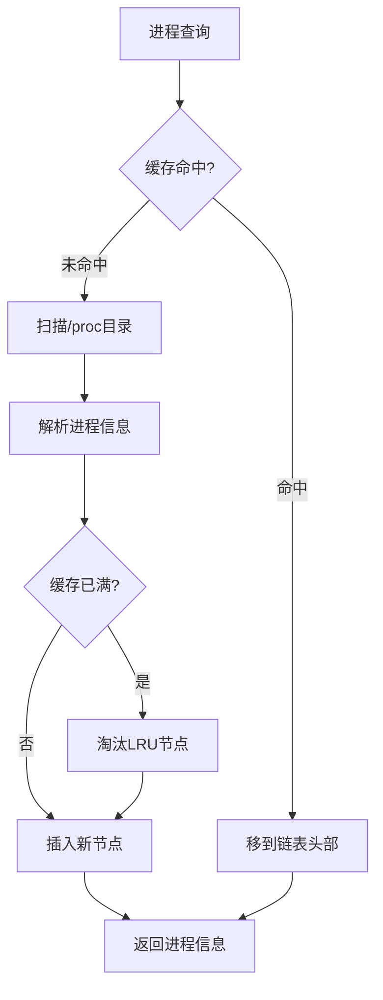

# LINX Process Cache - 进程缓存模块

## 📋 模块概述

`linx_process_cache` 是系统的进程缓存模块，负责缓存进程相关信息以提高查询效率。它通过实时扫描`/proc`文件系统，建立进程信息的LRU缓存，为事件丰富模块提供快速的进程信息查询服务。

## 🎯 核心功能

- **实时进程扫描**: 定期扫描`/proc`目录获取进程信息
- **LRU缓存管理**: 使用LRU算法管理进程信息缓存
- **快速查询接口**: 提供O(1)复杂度的进程信息查询
- **进程树构建**: 构建完整的进程父子关系树
- **内存优化**: 智能的内存使用和缓存淘汰策略

## 🔧 核心接口

### 主要API

```c
// 缓存生命周期管理
int linx_process_cache_init(void);
void linx_process_cache_deinit(void);

// 进程信息查询
linx_process_info_t *linx_process_cache_get(pid_t pid);
int linx_process_cache_get_children(pid_t pid, pid_t **children, int *count);
linx_process_info_t *linx_process_cache_get_parent(pid_t pid);

// 缓存管理
int linx_process_cache_refresh(void);
int linx_process_cache_clear(void);
int linx_process_cache_remove(pid_t pid);

// 统计接口
linx_cache_stats_t *linx_process_cache_get_stats(void);
```

### 进程信息结构

```c
typedef struct {
    pid_t pid;                      // 进程ID
    pid_t ppid;                     // 父进程ID
    uid_t uid;                      // 用户ID
    gid_t gid;                      // 组ID
    char name[256];                 // 进程名
    char cmdline[1024];             // 命令行
    char exe_path[512];             // 可执行文件路径
    char cwd[512];                  // 当前工作目录
    time_t start_time;              // 启动时间
    time_t cache_time;              // 缓存时间
    uint32_t flags;                 // 进程标志
    
    // 进程树关系
    struct linx_process_info_s *parent;    // 父进程
    struct linx_process_info_s **children; // 子进程数组
    int child_count;                // 子进程数量
    
    // LRU链表节点
    struct linx_process_info_s *prev;
    struct linx_process_info_s *next;
} linx_process_info_t;
```

### 缓存统计结构

```c
typedef struct {
    uint64_t total_queries;         // 总查询次数
    uint64_t cache_hits;            // 缓存命中次数
    uint64_t cache_misses;          // 缓存未命中次数
    uint64_t total_scans;           // 总扫描次数
    uint64_t processes_cached;      // 已缓存进程数
    uint64_t processes_evicted;     // 被淘汰进程数
    double hit_rate;                // 命中率
    size_t memory_usage;            // 内存使用量
    time_t last_scan_time;          // 最后扫描时间
} linx_cache_stats_t;
```

## 🏗️ 缓存架构

### LRU缓存设计



### 内存布局

```
LRU Cache Layout:
┌─────────────────────────────────────────────────────────┐
│                    Hash Table                           │
├─────────────────────────────────────────────────────────┤
│ PID_1 → ProcessInfo_1 ← → ProcessInfo_2 ← → ... (LRU)  │
│ PID_2 → ProcessInfo_5 ← → ProcessInfo_3 ← → ...        │
│ ...                                                     │
├─────────────────────────────────────────────────────────┤
│                 Process Tree                            │
│        Root                                             │
│       /    \                                            │
│  Child1    Child2                                       │
│   /  \       \                                          │
│ ...  ...     ...                                        │
└─────────────────────────────────────────────────────────┘
```

## 📊 性能优化

### 智能扫描策略

```c
// 扫描策略配置
typedef struct {
    int scan_interval;              // 扫描间隔(秒)
    int incremental_scan;           // 增量扫描
    int adaptive_interval;          // 自适应间隔
    int max_scan_processes;         // 单次最大扫描进程数
} scan_strategy_t;

// 自适应扫描间隔
void adjust_scan_interval(void) {
    linx_cache_stats_t *stats = linx_process_cache_get_stats();
    
    if (stats->hit_rate > 0.9) {
        // 命中率高，延长扫描间隔
        current_scan_interval = min(current_scan_interval * 1.5, MAX_SCAN_INTERVAL);
    } else if (stats->hit_rate < 0.7) {
        // 命中率低，缩短扫描间隔
        current_scan_interval = max(current_scan_interval * 0.8, MIN_SCAN_INTERVAL);
    }
}
```

### 增量扫描实现

```c
// 增量扫描：只扫描变化的进程
int incremental_proc_scan(void) {
    static time_t last_scan_time = 0;
    time_t current_time = time(NULL);
    
    DIR *proc_dir = opendir("/proc");
    if (!proc_dir) return -1;
    
    struct dirent *entry;
    while ((entry = readdir(proc_dir)) != NULL) {
        if (!isdigit(entry->d_name[0])) continue;
        
        pid_t pid = atoi(entry->d_name);
        
        // 检查进程是否已在缓存中
        linx_process_info_t *cached = linx_process_cache_get(pid);
        
        // 获取进程状态文件的修改时间
        char stat_path[256];
        snprintf(stat_path, sizeof(stat_path), "/proc/%d/stat", pid);
        
        struct stat file_stat;
        if (stat(stat_path, &file_stat) == 0) {
            // 如果文件修改时间晚于上次扫描，或进程不在缓存中
            if (file_stat.st_mtime > last_scan_time || !cached) {
                update_process_cache(pid);
            }
        }
    }
    
    closedir(proc_dir);
    last_scan_time = current_time;
    return 0;
}
```

## 🔍 进程树管理

### 进程树构建

```c
// 构建进程树关系
void build_process_tree(void) {
    // 清理现有树结构
    clear_process_tree();
    
    // 遍历所有缓存的进程
    for (int i = 0; i < cache->size; i++) {
        linx_process_info_t *proc = &cache->processes[i];
        
        if (proc->ppid == 0) {
            // 根进程
            add_to_root_processes(proc);
        } else {
            // 查找父进程
            linx_process_info_t *parent = linx_process_cache_get(proc->ppid);
            if (parent) {
                // 建立父子关系
                proc->parent = parent;
                add_child_process(parent, proc);
            }
        }
    }
}

// 获取进程的所有祖先
int get_process_ancestors(pid_t pid, pid_t *ancestors, int max_count) {
    int count = 0;
    linx_process_info_t *proc = linx_process_cache_get(pid);
    
    while (proc && proc->parent && count < max_count) {
        ancestors[count++] = proc->parent->pid;
        proc = proc->parent;
    }
    
    return count;
}

// 获取进程的所有后代
int get_process_descendants(pid_t pid, pid_t *descendants, int max_count) {
    int count = 0;
    linx_process_info_t *proc = linx_process_cache_get(pid);
    
    if (!proc) return 0;
    
    // 递归收集所有子进程
    collect_descendants_recursive(proc, descendants, &count, max_count);
    
    return count;
}
```

## 📈 内存管理

### LRU淘汰算法

```c
// LRU节点操作
void move_to_head(linx_process_info_t *proc) {
    if (proc == cache->head) return;
    
    // 从当前位置移除
    if (proc->prev) proc->prev->next = proc->next;
    if (proc->next) proc->next->prev = proc->prev;
    if (proc == cache->tail) cache->tail = proc->prev;
    
    // 插入到头部
    proc->prev = NULL;
    proc->next = cache->head;
    if (cache->head) cache->head->prev = proc;
    cache->head = proc;
    
    if (!cache->tail) cache->tail = proc;
}

// 淘汰LRU节点
linx_process_info_t *evict_lru_node(void) {
    if (!cache->tail) return NULL;
    
    linx_process_info_t *lru = cache->tail;
    
    // 从链表中移除
    cache->tail = lru->prev;
    if (cache->tail) cache->tail->next = NULL;
    else cache->head = NULL;
    
    // 从哈希表中移除
    hash_table_remove(cache->hash_table, lru->pid);
    
    // 清理进程树关系
    cleanup_process_tree_node(lru);
    
    cache->stats.processes_evicted++;
    
    return lru;
}
```

### 内存使用优化

```c
// 内存池管理
typedef struct {
    linx_process_info_t *free_list;
    int free_count;
    int total_allocated;
    size_t memory_usage;
} process_memory_pool_t;

// 分配进程信息节点
linx_process_info_t *allocate_process_info(void) {
    if (memory_pool.free_list) {
        // 从空闲列表获取
        linx_process_info_t *proc = memory_pool.free_list;
        memory_pool.free_list = proc->next;
        memory_pool.free_count--;
        
        // 清理节点
        memset(proc, 0, sizeof(linx_process_info_t));
        return proc;
    } else {
        // 分配新节点
        linx_process_info_t *proc = malloc(sizeof(linx_process_info_t));
        if (proc) {
            memory_pool.total_allocated++;
            memory_pool.memory_usage += sizeof(linx_process_info_t);
        }
        return proc;
    }
}

// 释放进程信息节点
void free_process_info(linx_process_info_t *proc) {
    if (!proc) return;
    
    // 添加到空闲列表
    proc->next = memory_pool.free_list;
    memory_pool.free_list = proc;
    memory_pool.free_count++;
}
```

## 🔧 配置选项

```yaml
process_cache:
  # 缓存基本配置
  cache_size: 10000             # 最大缓存进程数
  scan_interval: 5              # 扫描间隔(秒)
  enable_incremental_scan: true # 启用增量扫描
  
  # LRU配置
  lru_enabled: true             # 启用LRU淘汰
  max_memory_usage: "100MB"     # 最大内存使用
  
  # 进程树配置
  build_process_tree: true      # 构建进程树
  max_tree_depth: 20            # 最大树深度
  
  # 性能优化
  adaptive_scan_interval: true  # 自适应扫描间隔
  memory_pool_enabled: true     # 启用内存池
  
  # 过滤配置
  exclude_kernel_threads: true  # 排除内核线程
  exclude_short_lived: true     # 排除短生命周期进程
  min_lifetime: 1               # 最小生命周期(秒)
```

## 🚨 错误处理

```c
typedef enum {
    CACHE_ERROR_NONE = 0,
    CACHE_ERROR_PROC_ACCESS,        // /proc访问失败
    CACHE_ERROR_MEMORY_FULL,        // 内存不足
    CACHE_ERROR_INVALID_PID,        // 无效PID
    CACHE_ERROR_SCAN_FAILED,        // 扫描失败
} cache_error_t;

// 错误恢复策略
int handle_cache_error(cache_error_t error) {
    switch (error) {
        case CACHE_ERROR_MEMORY_FULL:
            // 强制淘汰部分缓存
            force_evict_cache_entries(cache->size / 4);
            break;
            
        case CACHE_ERROR_PROC_ACCESS:
            // 延长扫描间隔，减少访问频率
            current_scan_interval *= 2;
            break;
            
        default:
            return -1;
    }
    return 0;
}
```

## 📝 使用示例

```c
#include "linx_process_cache.h"

int main() {
    // 初始化进程缓存
    if (linx_process_cache_init() != 0) {
        fprintf(stderr, "Failed to init process cache\n");
        return -1;
    }
    
    // 查询进程信息
    pid_t target_pid = 1234;
    linx_process_info_t *proc_info = linx_process_cache_get(target_pid);
    
    if (proc_info) {
        printf("Process: %s (PID: %d, PPID: %d)\n", 
               proc_info->name, proc_info->pid, proc_info->ppid);
        printf("Command: %s\n", proc_info->cmdline);
        printf("Executable: %s\n", proc_info->exe_path);
        
        // 获取子进程
        pid_t *children;
        int child_count;
        if (linx_process_cache_get_children(target_pid, &children, &child_count) == 0) {
            printf("Children (%d): ", child_count);
            for (int i = 0; i < child_count; i++) {
                printf("%d ", children[i]);
            }
            printf("\n");
            free(children);
        }
    } else {
        printf("Process %d not found in cache\n", target_pid);
    }
    
    // 获取缓存统计
    linx_cache_stats_t *stats = linx_process_cache_get_stats();
    printf("Cache hit rate: %.2f%%\n", stats->hit_rate * 100);
    printf("Memory usage: %zu bytes\n", stats->memory_usage);
    
    // 清理资源
    linx_process_cache_deinit();
    return 0;
}
```