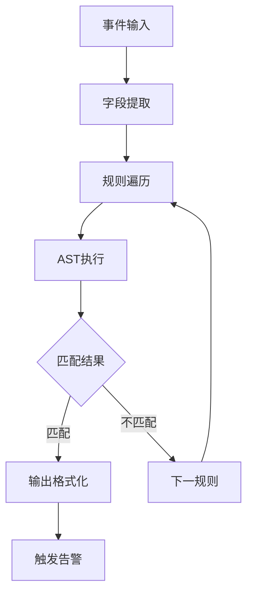

# LINX Rule Engine - 规则引擎模块

## 📋 模块概述

`linx_rule_engine` 是系统的核心规则引擎，负责将YAML格式的规则文件转换为可执行的检测逻辑。它实现了完整的规则解析、编译、匹配和执行流程，支持复杂的条件表达式和灵活的输出格式。

## 🎯 核心功能

- **规则解析**: 将YAML规则文件解析为内部数据结构
- **AST构建**: 构建抽象语法树用于条件表达式
- **规则编译**: 将规则编译为高效的执行代码
- **事件匹配**: 高性能的事件规则匹配
- **输出格式化**: 灵活的输出模板和格式化

## 🏗️ 模块结构

```
linx_rule_engine/
├── include/                        # 公共头文件
├── rule_engine_load/               # 规则加载子模块
│   ├── include/
│   │   └── linx_rule_engine_load.h
│   └── linx_rule_engine_load.c
├── rule_engine_match/              # 规则匹配子模块
│   ├── include/
│   │   └── linx_rule_engine_match.h
│   ├── linx_rule_engine_match.c
│   ├── match_func.c
│   ├── rule_match_func.c
│   └── output_match_func.c
├── rule_engine_ast/                # 抽象语法树子模块
│   ├── include/
│   │   └── linx_rule_engine_ast.h
│   ├── linx_rule_engine_ast.c
│   ├── ast_node.c
│   └── operation_type_string.c
├── rule_engine_lexer/              # 词法分析子模块
│   ├── include/
│   └── lexer.c
├── rule_engine_set/                # 规则集合管理子模块
│   └── include/
└── Makefile                        # 构建配置
```

## 🔧 核心接口

### 规则加载接口

```c
// 规则加载管理
int linx_rule_engine_load(const char *rules_file_path);

// 规则结构管理
linx_rule_t *linx_rule_create(void);
void linx_rule_destroy(linx_rule_t *rule);
```

### 规则结构定义

```c
typedef struct {
    char *name;                     // 规则名称
    char *desc;                     // 规则描述
    char *condition;                // 条件表达式
    char *output;                   // 输出模板
    char *priority;                 // 优先级
    char **tags;                    // 标签列表
    char *chdesc;                   // 中文描述
    struct {
        char *title;                // 通知标题
        char *content;              // 通知内容
    } notify;
} linx_rule_t;
```

### 规则匹配接口

```c
// 规则匹配执行
int linx_rule_set_match_rule(void);
int linx_rule_engine_match(linx_event_t *event, linx_rule_t *rule);

// 输出匹配处理
int linx_output_match_func(char *output_template, linx_event_t *event);
```

## 🌳 抽象语法树 (AST) 子模块

### 功能特性
- **表达式解析**: 解析复杂的条件表达式
- **语法树构建**: 构建高效的抽象语法树
- **类型检查**: 静态类型检查和验证
- **优化处理**: AST优化和简化

### AST节点类型

```c
typedef enum {
    AST_NODE_BINARY_OP,         // 二元操作符 (and, or, =, >, <, etc.)
    AST_NODE_UNARY_OP,          // 一元操作符 (not)
    AST_NODE_FIELD,             // 字段引用 (evt.type, proc.name)
    AST_NODE_LITERAL,           // 字面量 (字符串, 数字)
    AST_NODE_LIST,              // 列表 (in操作的参数)
    AST_NODE_FUNCTION,          // 函数调用 (contains, startswith)
} ast_node_type_t;
```

### 支持的操作符

| 操作符 | 描述 | 示例 |
|--------|------|------|
| `and` | 逻辑与 | `evt.type = execve and proc.name = bash` |
| `or` | 逻辑或 | `proc.name = vim or proc.name = nano` |
| `not` | 逻辑非 | `not proc.name = root` |
| `=` | 等于 | `evt.type = execve` |
| `!=` | 不等于 | `proc.uid != 0` |
| `>` | 大于 | `proc.pid > 1000` |
| `>=` | 大于等于 | `proc.uid >= 1000` |
| `<` | 小于 | `evt.time < 1000000` |
| `<=` | 小于等于 | `proc.gid <= 100` |
| `contains` | 包含 | `proc.cmdline contains "/etc/passwd"` |
| `icontains` | 忽略大小写包含 | `proc.name icontains "BASH"` |
| `startswith` | 以...开始 | `fd.name startswith "/tmp/"` |
| `endswith` | 以...结束 | `fd.name endswith ".sh"` |
| `in` | 在列表中 | `proc.name in (bash, sh, zsh)` |

## 🔍 词法分析 (Lexer) 子模块

### 功能特性
- **词法扫描**: 将规则文本分解为Token序列
- **语法验证**: 验证词法的正确性
- **错误报告**: 详细的语法错误信息
- **符号表**: 管理字段和函数符号

### Token类型

```c
typedef enum {
    TOKEN_FIELD,                // 字段标识符
    TOKEN_STRING,               // 字符串字面量
    TOKEN_NUMBER,               // 数字字面量
    TOKEN_OPERATOR,             // 操作符
    TOKEN_FUNCTION,             // 函数名
    TOKEN_LPAREN,               // 左括号
    TOKEN_RPAREN,               // 右括号
    TOKEN_COMMA,                // 逗号
    TOKEN_EOF,                  // 文件结束
} token_type_t;
```

## 🎯 规则匹配 (Match) 子模块

### 匹配引擎
- **高效匹配**: 优化的规则匹配算法
- **字段绑定**: 动态字段值绑定机制
- **类型转换**: 自动类型转换和比较
- **缓存机制**: 匹配结果缓存优化

### 匹配流程



### 字段绑定机制

使用哈希表实现O(1)复杂度的字段查找：

```c
// 字段类型定义
typedef struct {
    char *field_name;               // 字段名 (如 "proc.name")
    void *data_ptr;                 // 数据指针
    linx_type_t data_type;          // 数据类型
    size_t offset;                  // 结构体偏移量
} field_binding_t;
```

## 📝 输出格式化

### 模板语法

支持占位符替换的输出模板：

```yaml
output: >
  [ALERT] %evt.time User=%user.name opened sensitive file %fd.name 
  using %proc.name (%proc.cmdline pid=%proc.pid ppid=%proc.ppid)
```

### 支持的占位符

| 占位符 | 描述 | 示例 |
|--------|------|------|
| `%evt.time` | 事件时间 | `1642734567` |
| `%evt.type` | 事件类型 | `execve` |
| `%proc.name` | 进程名 | `bash` |
| `%proc.pid` | 进程ID | `1234` |
| `%proc.cmdline` | 命令行 | `/bin/bash script.sh` |
| `%fd.name` | 文件名 | `/etc/passwd` |
| `%user.name` | 用户名 | `root` |

## 🔧 规则集合 (Set) 管理

### 规则集合结构
- **规则列表**: 管理加载的所有规则
- **索引优化**: 基于字段的快速索引
- **优先级排序**: 按优先级排序执行
- **动态更新**: 支持规则的热更新

### 优化策略
- **预过滤**: 基于事件类型预过滤规则
- **字段索引**: 为常用字段建立索引
- **批量匹配**: 批量处理多个事件
- **并行执行**: 多线程并行规则匹配

## ⚙️ 配置和使用

### 规则文件格式

```yaml
- rule: Passwd File Access by File Open
  desc: Detect direct file open of sensitive files
  condition: >
    evt.type = execve and
    proc.name in (vim, vi, nvim, cat, less, more, tail, head) and
    proc.args = "/etc/passwd" and
    proc.cmdline contains "/etc/passwd"
  output: >
    [ALERT] %evt.time User=%user.name opened sensitive file %fd.name 
    using %proc.name (%proc.cmdline pid=%proc.pid ppid=%proc.ppid)
  priority: WARNING
  tags: [filesystem, sensitive]
  notify:
    title: 敏感文件读取
    content: 命令行读取/etc/passwd行为，请确认是否为合法操作
  chdesc: 读取/etc/passwd敏感文件

- rule: Suspicious Network Connection
  desc: Detect suspicious outbound network connections
  condition: >
    evt.type = connect and
    fd.net.cip not in (127.0.0.1, ::1) and
    proc.name not in (ssh, curl, wget, apt, yum)
  output: >
    [ALERT] Suspicious connection from %proc.name (pid=%proc.pid) 
    to %fd.net.cip:%fd.net.cport
  priority: HIGH
  tags: [network, suspicious]
```

### 优先级级别

| 级别 | 描述 | 用途 |
|------|------|------|
| `DEBUG` | 调试级别 | 开发和调试使用 |
| `INFO` | 信息级别 | 一般信息记录 |
| `WARNING` | 警告级别 | 潜在的安全问题 |
| `ERROR` | 错误级别 | 明确的安全威胁 |
| `CRITICAL` | 严重级别 | 严重的安全事件 |

## 📊 性能优化

### 编译优化
- **AST缓存**: 缓存编译后的AST
- **常量折叠**: 编译时常量计算
- **死代码消除**: 移除无用的条件分支
- **表达式简化**: 简化逻辑表达式

### 运行时优化
- **快速路径**: 常见条件的快速判断
- **字段缓存**: 缓存字段值避免重复计算
- **批量处理**: 批量处理多个事件
- **内存池**: 减少内存分配开销

## 🚨 错误处理

### 语法错误
```
Rule parsing error: line 5, column 12
Unexpected token '=' after 'proc.name'
Expected: 'in', 'contains', '!=', etc.
```

### 类型错误
```
Type mismatch: comparing string 'execve' with number 123
Field 'proc.pid' expects number, got string
```

### 运行时错误
```
Field 'proc.unknown_field' not found in event
Function 'unknown_func' not supported
```

## 🔍 调试和监控

### 调试功能
- **AST转储**: 输出抽象语法树结构
- **执行跟踪**: 跟踪规则执行过程
- **性能分析**: 规则执行时间统计
- **内存使用**: 内存使用情况监控

### 统计信息
- 规则加载数量
- 匹配成功/失败次数
- 平均匹配时间
- 内存使用峰值

## 🔗 模块依赖

### 外部依赖
- **libyaml**: YAML文件解析
- **pcre2**: 正则表达式支持
- **uthash**: 哈希表实现

### 内部依赖
- `linx_event` - 事件结构定义
- `linx_hash_map` - 字段绑定
- `linx_log` - 日志输出
- `linx_alert` - 告警输出

## 📝 使用示例

### 基本使用

```c
#include "linx_rule_engine_load.h"
#include "linx_rule_engine_match.h"

// 加载规则文件
int ret = linx_rule_engine_load("/etc/linx_apd/rules.yaml");
if (ret != 0) {
    fprintf(stderr, "Failed to load rules\n");
    return -1;
}

// 匹配事件
linx_event_t *event = get_event();
ret = linx_rule_set_match_rule(event);
if (ret > 0) {
    printf("Rule matched, alert triggered\n");
}
```

### 规则开发示例

```yaml
# 检测密码文件访问
- rule: Password File Access
  desc: Detect access to password files
  condition: >
    evt.type = open and
    fd.name in ("/etc/passwd", "/etc/shadow", "/etc/group") and
    proc.name not in (login, sshd, systemd)
  output: >
    Password file %fd.name accessed by %proc.name (user=%user.name)
  priority: WARNING
  tags: [filesystem, authentication]
```

## 🚀 扩展开发

### 添加新操作符

1. 在词法分析器中添加Token定义
2. 在AST中添加新的节点类型
3. 实现操作符的匹配逻辑
4. 添加测试用例

### 添加新字段

1. 在事件结构中定义新字段
2. 在字段绑定表中注册字段
3. 实现字段值获取逻辑
4. 更新文档和示例

### 自定义函数

1. 定义函数接口
2. 实现函数逻辑
3. 注册到函数表
4. 添加语法支持