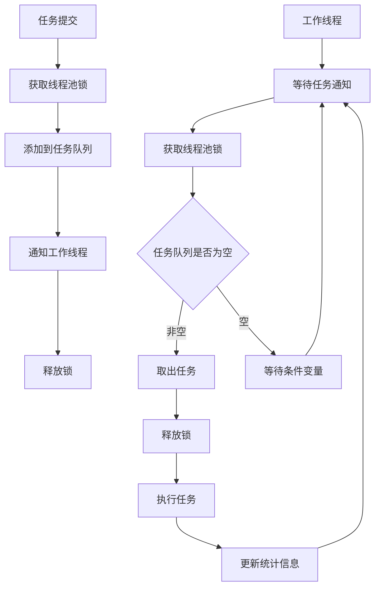

# LINX Thread - 线程管理模块

## 📋 模块概述

`linx_thread` 是系统的线程管理模块，为其他模块提供线程池服务、任务调度和线程生命周期管理。它实现了高效的线程池、任务队列管理和工作线程调度，确保系统的并发处理能力和资源的合理利用。

## 🎯 核心功能

- **线程池管理**: 创建和管理工作线程池
- **任务调度**: 高效的任务分发和执行
- **线程状态监控**: 监控线程状态和性能指标
- **动态调整**: 支持线程池大小的动态调整
- **优雅关闭**: 支持线程池的优雅关闭和资源清理

## 🔧 核心接口

### 主要API

```c
// 线程池生命周期管理
linx_thread_pool_t *linx_thread_pool_create(int num_threads);
int linx_thread_pool_destroy(linx_thread_pool_t *pool, int graceful);

// 任务管理
int linx_thread_pool_add_task(linx_thread_pool_t *pool, 
                              void *(*func)(void *, int *), 
                              void *arg);

// 线程控制
int linx_thread_pool_pause_thread(linx_thread_pool_t *pool, int thread_index);
int linx_thread_pool_resume_thread(linx_thread_pool_t *pool, int thread_index);
int linx_thread_pool_terminate_thread(linx_thread_pool_t *pool, int thread_index);

// 状态查询
linx_thread_state_t linx_thread_pool_get_thread_state(linx_thread_pool_t *pool, int thread_index);
int linx_thread_pool_get_queue_size(linx_thread_pool_t *pool);
int linx_thread_pool_get_active_threads(linx_thread_pool_t *pool);
```

### 核心数据结构

#### 线程池结构

```c
typedef struct {
    pthread_mutex_t lock;           // 线程池互斥锁
    pthread_cond_t notify;          // 条件变量
    linx_thread_info_t *threads;    // 线程信息数组
    linx_task_t *task_queue_head;   // 任务队列头
    linx_task_t *task_queue_tail;   // 任务队列尾
    int thread_count;               // 线程总数
    int active_threads;             // 活跃线程数
    int queue_size;                 // 队列大小
    int shutdown;                   // 关闭标志
} linx_thread_pool_t;
```

#### 任务结构

```c
typedef struct linx_task_s {
    void *(*func)(void *, int *);   // 任务函数
    void *arg;                      // 任务参数
    int should_stop;                // 停止标志
    struct linx_task_s *next;       // 下一个任务
} linx_task_t;
```

#### 线程信息结构

```c
typedef struct {
    pthread_t thread_id;            // 线程ID
    linx_thread_state_t state;      // 线程状态
    int thread_index;               // 线程索引
    linx_thread_pool_t *pool;       // 所属线程池
    uint64_t tasks_processed;       // 处理任务数量
    uint64_t total_runtime;         // 总运行时间
    time_t created_time;            // 创建时间
    time_t last_active_time;        // 最后活跃时间
} linx_thread_info_t;
```

#### 线程状态枚举

```c
typedef enum {
    THREAD_STATE_IDLE,              // 空闲状态
    THREAD_STATE_RUNNING,           // 运行状态
    THREAD_STATE_PAUSED,            // 暂停状态
    THREAD_STATE_TERMINATING,       // 终止中
    THREAD_STATE_TERMINATED,        // 已终止
    THREAD_STATE_ERROR,             // 错误状态
} linx_thread_state_t;
```

## 🏗️ 线程池架构

### 工作原理



### 任务调度策略

```c
// FIFO调度 (默认)
typedef enum {
    SCHEDULE_FIFO,                  // 先进先出
    SCHEDULE_LIFO,                  // 后进先出
    SCHEDULE_PRIORITY,              // 优先级调度
    SCHEDULE_ROUND_ROBIN,           // 轮询调度
    SCHEDULE_WORK_STEALING,         // 工作窃取
} schedule_strategy_t;
```

## ⚡ 性能优化

### 工作线程实现

```c
void *worker_thread(void *thread_info) {
    linx_thread_info_t *info = (linx_thread_info_t *)thread_info;
    linx_thread_pool_t *pool = info->pool;
    linx_task_t *task;
    
    while (1) {
        pthread_mutex_lock(&pool->lock);
        
        // 等待任务或关闭信号
        while (pool->task_queue_head == NULL && !pool->shutdown) {
            info->state = THREAD_STATE_IDLE;
            pthread_cond_wait(&pool->notify, &pool->lock);
        }
        
        // 检查是否需要关闭
        if (pool->shutdown) {
            info->state = THREAD_STATE_TERMINATING;
            pthread_mutex_unlock(&pool->lock);
            break;
        }
        
        // 取出任务
        task = pool->task_queue_head;
        if (task) {
            pool->task_queue_head = task->next;
            if (pool->task_queue_head == NULL) {
                pool->task_queue_tail = NULL;
            }
            pool->queue_size--;
        }
        
        info->state = THREAD_STATE_RUNNING;
        pthread_mutex_unlock(&pool->lock);
        
        // 执行任务
        if (task && task->func) {
            clock_t start_time = clock();
            task->func(task->arg, &task->should_stop);
            clock_t end_time = clock();
            
            // 更新统计信息
            info->tasks_processed++;
            info->total_runtime += (end_time - start_time);
            info->last_active_time = time(NULL);
            
            free(task);
        }
    }
    
    info->state = THREAD_STATE_TERMINATED;
    return NULL;
}
```

### 动态调整

```c
// 动态增加线程
int linx_thread_pool_add_threads(linx_thread_pool_t *pool, int count) {
    pthread_mutex_lock(&pool->lock);
    
    int old_count = pool->thread_count;
    int new_count = old_count + count;
    
    // 重新分配线程信息数组
    linx_thread_info_t *new_threads = realloc(pool->threads, 
                                               new_count * sizeof(linx_thread_info_t));
    if (!new_threads) {
        pthread_mutex_unlock(&pool->lock);
        return -1;
    }
    
    pool->threads = new_threads;
    
    // 创建新线程
    for (int i = old_count; i < new_count; i++) {
        linx_thread_info_t *info = &pool->threads[i];
        info->thread_index = i;
        info->pool = pool;
        info->state = THREAD_STATE_IDLE;
        info->tasks_processed = 0;
        info->total_runtime = 0;
        info->created_time = time(NULL);
        
        if (pthread_create(&info->thread_id, NULL, worker_thread, info) != 0) {
            pthread_mutex_unlock(&pool->lock);
            return -1;
        }
    }
    
    pool->thread_count = new_count;
    pthread_mutex_unlock(&pool->lock);
    
    return 0;
}

// 动态减少线程
int linx_thread_pool_remove_threads(linx_thread_pool_t *pool, int count) {
    if (count >= pool->thread_count) {
        return -1; // 不能删除所有线程
    }
    
    pthread_mutex_lock(&pool->lock);
    
    // 标记要删除的线程
    for (int i = pool->thread_count - count; i < pool->thread_count; i++) {
        pool->threads[i].state = THREAD_STATE_TERMINATING;
    }
    
    // 通知所有线程检查状态
    pthread_cond_broadcast(&pool->notify);
    pthread_mutex_unlock(&pool->lock);
    
    // 等待线程结束
    for (int i = pool->thread_count - count; i < pool->thread_count; i++) {
        pthread_join(pool->threads[i].thread_id, NULL);
    }
    
    pthread_mutex_lock(&pool->lock);
    pool->thread_count -= count;
    pthread_mutex_unlock(&pool->lock);
    
    return 0;
}
```

## 📊 监控和统计

### 性能指标

```c
typedef struct {
    int total_threads;              // 总线程数
    int active_threads;             // 活跃线程数
    int idle_threads;               // 空闲线程数
    int queue_size;                 // 任务队列大小
    uint64_t total_tasks_processed; // 总处理任务数
    uint64_t total_tasks_failed;    // 总失败任务数
    double avg_task_time;           // 平均任务执行时间
    double cpu_utilization;         // CPU利用率
    time_t uptime;                  // 运行时间
} thread_pool_stats_t;
```

### 监控接口

```c
// 获取线程池统计信息
thread_pool_stats_t *linx_thread_pool_get_stats(linx_thread_pool_t *pool);

// 获取单个线程信息
linx_thread_info_t *linx_thread_pool_get_thread_info(linx_thread_pool_t *pool, int index);

// 获取所有线程状态
int linx_thread_pool_get_all_thread_states(linx_thread_pool_t *pool, 
                                            linx_thread_state_t *states, 
                                            int max_count);
```

### 性能报告

```bash
Thread Pool Statistics:
  Total Threads: 8
  Active Threads: 6 (75%)
  Idle Threads: 2 (25%)
  Queue Size: 15
  Total Tasks Processed: 125,674
  Total Tasks Failed: 12
  Success Rate: 99.99%
  Average Task Time: 2.3ms
  CPU Utilization: 78%
  Uptime: 2h 15m 30s

Per-Thread Statistics:
  Thread 0: RUNNING  | Tasks: 15,234 | Runtime: 1h 25m
  Thread 1: IDLE     | Tasks: 14,821 | Runtime: 1h 22m
  Thread 2: RUNNING  | Tasks: 15,678 | Runtime: 1h 28m
  ...
```

## 🔧 配置选项

### 基本配置

```yaml
thread_pool:
  # 基本参数
  initial_threads: 4            # 初始线程数
  max_threads: 16               # 最大线程数
  min_threads: 2                # 最小线程数
  
  # 任务队列配置
  max_queue_size: 1000          # 最大队列大小
  queue_timeout: 5000           # 队列超时(ms)
  
  # 线程生命周期
  thread_idle_timeout: 60       # 线程空闲超时(s)
  thread_create_timeout: 5      # 线程创建超时(s)
  
  # 调度策略
  schedule_strategy: "fifo"     # fifo, lifo, priority, round_robin
  load_balance: true            # 启用负载均衡
```

### 高级配置

```yaml
thread_pool:
  # 动态调整
  auto_scaling:
    enabled: true               # 启用自动扩缩容
    scale_up_threshold: 0.8     # 扩容阈值
    scale_down_threshold: 0.3   # 缩容阈值
    scale_interval: 30          # 调整间隔(s)
    
  # 性能优化
  performance:
    cpu_affinity: true          # CPU亲和性
    priority: "normal"          # 线程优先级
    stack_size: "2MB"           # 线程栈大小
    
  # 监控配置
  monitoring:
    enable_stats: true          # 启用统计
    stats_interval: 10          # 统计间隔(s)
    enable_profiling: false     # 启用性能分析
```

## 🚨 错误处理

### 错误类型

```c
typedef enum {
    THREAD_ERROR_NONE = 0,
    THREAD_ERROR_CREATE_FAILED,     // 线程创建失败
    THREAD_ERROR_DESTROY_FAILED,    // 线程销毁失败
    THREAD_ERROR_TIMEOUT,           // 操作超时
    THREAD_ERROR_INVALID_PARAM,     // 无效参数
    THREAD_ERROR_MEMORY,            // 内存不足
    THREAD_ERROR_DEADLOCK,          // 死锁检测
    THREAD_ERROR_QUEUE_FULL,        // 队列已满
} thread_error_t;
```

### 错误恢复策略

```c
// 死锁检测和恢复
int detect_and_recover_deadlock(linx_thread_pool_t *pool) {
    // 检测死锁模式
    if (is_deadlock_detected(pool)) {
        // 记录死锁信息
        log_deadlock_info(pool);
        
        // 尝试恢复：重置锁状态
        pthread_mutex_unlock(&pool->lock);
        usleep(1000); // 短暂等待
        
        // 重新初始化锁
        pthread_mutex_destroy(&pool->lock);
        pthread_mutex_init(&pool->lock, NULL);
        
        return 0;
    }
    return -1;
}

// 线程异常处理
void handle_thread_exception(linx_thread_info_t *info, int error_code) {
    info->state = THREAD_STATE_ERROR;
    
    switch (error_code) {
        case THREAD_ERROR_MEMORY:
            // 内存不足：暂停线程
            pthread_mutex_lock(&info->pool->lock);
            info->state = THREAD_STATE_PAUSED;
            pthread_mutex_unlock(&info->pool->lock);
            break;
            
        case THREAD_ERROR_TIMEOUT:
            // 超时：重启线程
            restart_thread(info);
            break;
            
        default:
            // 其他错误：终止线程
            info->state = THREAD_STATE_TERMINATING;
            break;
    }
}
```

## 🔍 调试和诊断

### 调试接口

```c
// 线程池健康检查
typedef struct {
    bool is_healthy;
    int num_issues;
    char issues[10][256];
} health_check_result_t;

health_check_result_t *linx_thread_pool_health_check(linx_thread_pool_t *pool);

// 线程栈跟踪
int linx_thread_get_stack_trace(pthread_t thread_id, void **trace, int max_frames);

// 性能分析
typedef struct {
    double cpu_time;
    double wall_time;
    uint64_t context_switches;
    uint64_t memory_usage;
} thread_profile_t;

thread_profile_t *linx_thread_get_profile(linx_thread_info_t *info);
```

### 诊断工具

```c
// 死锁检测器
bool is_deadlock_detected(linx_thread_pool_t *pool) {
    // 检查锁等待图
    // 检查循环依赖
    // 返回是否检测到死锁
    return check_lock_dependency_graph(pool);
}

// 性能瓶颈分析
typedef struct {
    char bottleneck_type[64];
    double severity;
    char description[256];
    char suggestion[256];
} bottleneck_analysis_t;

bottleneck_analysis_t *analyze_performance_bottleneck(linx_thread_pool_t *pool);
```

## 🔗 模块依赖

### 外部依赖
- **pthread**: POSIX线程库
- **libc**: 标准C库

### 内部依赖
- `linx_log` - 日志输出
- `linx_config` - 配置管理

## 📝 使用示例

### 基本使用

```c
#include "linx_thread_pool.h"

// 任务函数示例
void *process_event_task(void *arg, int *should_stop) {
    linx_event_t *event = (linx_event_t *)arg;
    
    // 检查停止信号
    if (*should_stop) {
        return NULL;
    }
    
    // 处理事件
    process_security_event(event);
    
    return NULL;
}

int main() {
    // 创建线程池
    linx_thread_pool_t *pool = linx_thread_pool_create(4);
    if (!pool) {
        fprintf(stderr, "Failed to create thread pool\n");
        return -1;
    }
    
    // 提交任务
    for (int i = 0; i < 100; i++) {
        linx_event_t *event = get_next_event();
        int ret = linx_thread_pool_add_task(pool, process_event_task, event);
        if (ret != 0) {
            fprintf(stderr, "Failed to add task %d\n", i);
        }
    }
    
    // 等待任务完成
    while (linx_thread_pool_get_queue_size(pool) > 0) {
        usleep(100000); // 100ms
    }
    
    // 销毁线程池
    linx_thread_pool_destroy(pool, 1); // 优雅关闭
    
    return 0;
}
```

### 高级使用

```c
// 带优先级的任务处理
typedef struct {
    void *data;
    int priority;
    task_callback_t callback;
} priority_task_t;

// 优先级任务比较函数
int compare_priority_tasks(const void *a, const void *b) {
    priority_task_t *task_a = (priority_task_t *)a;
    priority_task_t *task_b = (priority_task_t *)b;
    return task_b->priority - task_a->priority; // 高优先级在前
}

// 自定义调度器
void *priority_scheduler(void *arg, int *should_stop) {
    linx_thread_pool_t *pool = (linx_thread_pool_t *)arg;
    
    while (!*should_stop) {
        // 获取任务队列
        pthread_mutex_lock(&pool->lock);
        
        if (pool->queue_size > 0) {
            // 对任务队列按优先级排序
            sort_task_queue_by_priority(pool);
        }
        
        pthread_mutex_unlock(&pool->lock);
        
        usleep(10000); // 10ms调度间隔
    }
    
    return NULL;
}
```

## 🚀 扩展开发

### 工作窃取算法

```c
// 工作窃取线程池
typedef struct {
    linx_thread_pool_t *base_pool;
    linx_task_queue_t *local_queues;    // 每个线程的本地队列
    pthread_mutex_t *queue_locks;       // 每个队列的锁
} work_stealing_pool_t;

// 工作窃取逻辑
void *work_stealing_worker(void *arg) {
    linx_thread_info_t *info = (linx_thread_info_t *)arg;
    work_stealing_pool_t *ws_pool = (work_stealing_pool_t *)info->pool;
    int my_index = info->thread_index;
    
    while (!info->pool->shutdown) {
        linx_task_t *task = NULL;
        
        // 首先尝试从本地队列获取任务
        pthread_mutex_lock(&ws_pool->queue_locks[my_index]);
        task = dequeue_task(&ws_pool->local_queues[my_index]);
        pthread_mutex_unlock(&ws_pool->queue_locks[my_index]);
        
        // 如果本地队列为空，尝试从其他线程窃取任务
        if (!task) {
            for (int i = 0; i < info->pool->thread_count; i++) {
                if (i != my_index) {
                    pthread_mutex_lock(&ws_pool->queue_locks[i]);
                    task = steal_task(&ws_pool->local_queues[i]);
                    pthread_mutex_unlock(&ws_pool->queue_locks[i]);
                    
                    if (task) break;
                }
            }
        }
        
        // 执行任务
        if (task) {
            execute_task(task);
        } else {
            // 没有任务，短暂休眠
            usleep(1000);
        }
    }
    
    return NULL;
}
```

### 线程池集群

```c
// 线程池集群管理
typedef struct {
    linx_thread_pool_t **pools;
    int pool_count;
    int next_pool_index;
    pthread_mutex_t cluster_lock;
} thread_pool_cluster_t;

// 创建线程池集群
thread_pool_cluster_t *create_thread_pool_cluster(int pool_count, int threads_per_pool) {
    thread_pool_cluster_t *cluster = malloc(sizeof(thread_pool_cluster_t));
    cluster->pools = malloc(pool_count * sizeof(linx_thread_pool_t *));
    cluster->pool_count = pool_count;
    cluster->next_pool_index = 0;
    pthread_mutex_init(&cluster->cluster_lock, NULL);
    
    for (int i = 0; i < pool_count; i++) {
        cluster->pools[i] = linx_thread_pool_create(threads_per_pool);
    }
    
    return cluster;
}

// 负载均衡任务分发
int cluster_add_task(thread_pool_cluster_t *cluster, 
                     void *(*func)(void *, int *), 
                     void *arg) {
    pthread_mutex_lock(&cluster->cluster_lock);
    
    // 轮询分发策略
    int pool_index = cluster->next_pool_index;
    cluster->next_pool_index = (cluster->next_pool_index + 1) % cluster->pool_count;
    
    pthread_mutex_unlock(&cluster->cluster_lock);
    
    return linx_thread_pool_add_task(cluster->pools[pool_index], func, arg);
}
```